第 1 章 scala 的概述

### Scala 程序反编译-说明scala 程序的执行流程

```scala
//下面我们说明一下 scala 程序的一执行流程
//分析
//1. object  在底层会生成两个类 Hello , Hello$
//2. Hello  中有个 main 函数，调用 Hello$  类的一个静态对象 MODULES$
/*
public final class Hello
{
    public static void main(String[] paramArrayOfString)
    {
    Hello$.MODULE$.main(paramArrayOfString);
    }
}
*/
//3. Hello$.MODULE$. 对象时静态的，通过该对象调用 Hello$的 main 函数
/*
public void main(String[] args)
{
	Predef..MODULE$.println("hello,scala");
}
*/
//4. 可以理解我们在 main 中写的代码在放在 Hello$ 的 main, 在底层执行 scala 编译器做了一个包
装


object Hello {
def main(args: Array[String]): Unit = { println("hello,scala")
}
}
```

### Scala 语言输出的三种方式

1.  字符串通过+号连接（类似 java）。
2.  printf 用法 （类似 C 语言）字符串通过 % 传值。
3.  字符串通过\$引用(类似 PHP）。

```scala
object TestPrint {
def main(args: Array[String]): Unit = {
//使用+
	var name : String = "tom" 
	var sal : Double = 1.2 
    println("hello" + sal + name )

// 使 用 格 式 化 的 方 式 
    printf printf("name=%s sal=%f\n", name, sal)
//使用$引用的方式，输出变量，类似 php
    println(s"第三种方式 name=$name sal = ${sal + 1}")
}
}
```


# 第 2 章 变量

### 变量声明基本语法

var \| val 变量名 \[: 变量类型\] = 变量值       (scala 要求变量声明时初始化)

### 注意事项

1. 声明变量时，类型可以省略（编译器自动推导,即类型推导）

2. 类型确定后，就不能修改，说明 Scala 是强数据类型语言.

3. 在声明/定义一个变量时，可以使用 var 或者 val 来修饰， var 修饰的变量可改变，val 修饰的变量不可改

4. val 修饰的变量在编译后，等同于加上 final， 通过反编译看下底层代码。

5. var 修饰的对象引用可以改变，val 修饰的则不可改变，但对象的状态(值)却是可以改变的。(比如: 自定义对象、数组、集合等等) \[分析 val 好处\]

6. 变量声明时，需要初始值。

### 数据类型

1)  Scala 与 Java 有着相同的数据类型，**在 Scala 中数据类型都是对象**

2)  Scala 数据类型分为两大类 **AnyVal**(值类型) 和 **AnyRef**(引用类型)， 注意：不管是 AnyVal 还是 AnyRef 都是对象。

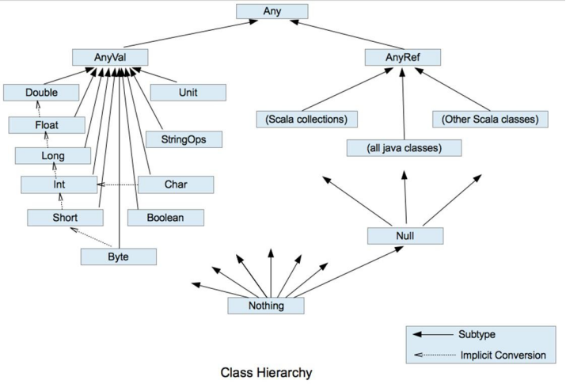

对上面图的小结和整理

1. 在 scala 中有一个根类型 Any ,他是所有类的父类.

2. scala 中一切皆为对象，分为两大类 AnyVal(值类型)， AnyRef(引用类型)， 他们都是 Any 子类.

3. Null 类型是 scala 的特别类型，它只有一个值 null, 他是 bottom calss ,是 所有 AnyRef 类型的子类.

4. Nothing 类型也是 bottom class ,他是所有类的子类，在开发中通常可以将 Nothing 类型的值返回给任意变量或者函数， 这里抛出异常使用很多.

   ```scala
   def sayHello: Nothing = {
   	throw	new Exception("抛出异常")
   }
   ```

5. 在 scala 中仍然遵守，低精度的值，向高精度的值自动转换(implicit conversion) 隐式转换.

### Unit 类型、Null 类型和 Nothing 类型


使用细节

1. Null 类只有一个实例对象，null，类似于 Java 中的 null 引用。null 可以赋值给任意引用类型(AnyRef)，但是不能赋值给值类型(AnyVal: 比如 Int, Float, Char, Boolean, Long, Double, Byte, Short)

2. Unit 类型用来标识过程，也就是没有明确返回值的函数。由此可见，Unit 类似于 Java 里的 void。Unit 只有一个实例，()，这个实例也没有实质的意义

3. Nothing，可以作为没有正常返回值的方法的返回类型，非常直观的告诉你这个方法不会正常返回，而且由于 Nothing 是其他任意类型的子类，他还能跟要求返回值的方法兼容。

### 标识符的命名规范

#### 标识符概念

Scala 对各种变量、方法、函数等命名时使用的字符序列称为标识符，凡是自己可以起名字的地方都叫标识符

#### 标识符的命名规则

42. 首字符为字母，后续字符任意字母和数字，美元符号，可后接下划线\_

43. 数字不可以开头。

44. 首字符为操作符(比如+ - \* / )，后续字符也需跟操作符 ,至少一个(反编译)

45. 操作符(比如+-\*/)不能在标识符中间和最后.

46. 用反引号\`\....\`包括的任意字符串，即使是关键字(39 个)也可以 \[true\]

#### 标识符举例说明

```
hello			// ok 
hello12 // ok 
1hello		// error 
h-b	// error
x h	// error
h_4	// ok
_ab	// ok
Int	// ok,  在 scala 中，Int  不是关键字，而是预定义标识符,可以用，但是不推荐
Float	// ok
_	// 不可以，因为在 scala 中，_  有很多其他的作用，因此不能使用
Abc	// ok
+*-	// ok
+a	// error
```

### scala 的关键字 

```
package, import, class, object, trait, extends, with, type, forSome 
private, protected, abstract, sealed, final, implicit, lazy, override 
try, catch, finally, throw
if, else, match, case, do, while, for, return, yield 
def, val, var
this, super 
new
true, false, null
```

# 第 3 章 程序流程控制

### 分支控制if-else

#### 分支控制if-else 注意事项

1. 如果大括号{}内的逻辑代码只有一行，大括号可以省略, 这点和 java 的规定一样。

2. Scala 中任意表达式都是有返回值的，也就意味着 if else 表达式其实是有返回结果的，具体返回结果的值取决于满足条件的代码体的最后一行内容

3. Scala 中是没有三元运算符

### switch 分支结构

在 scala 中没有 switch,而是**使用模式匹配来处理**。

### for 循环控制

```scala
for(i <- 1 to 3){print(i + " ")}

for (i <- start to end) { println("你好，尚硅谷" + i)}

for(i <- 1 until 3) { print(i + " ")}

for(i <- 1 to 3 if i != 2) { print(i + " ")}//循环守卫，即循环保护式（也称条件判断式，守卫）。保护式为 true 则进入循环体内部，为 false则跳过，类似于 continue

val res = for(i <- 1 to 10) yield i//将遍历过程中处理的结果返回到一个新 Vector 集合中，使用 yield 关键字
```

### while 循环控制

#### 注意事项和细节说明

1. 与 If 语句不同，While 语句本身没有值，即整个 While 语句的结果是 Unit 类型的()

2. 因为 while 中没有返回值,所以当要用该语句来计算并返回结果时,就不可避免的使用变量 ，而变量需要声明在 while 循环的外部，那么就等同于循环的内部对外部的变量造成了影响，所以不推荐使用，而是**推荐使用 for 循环**。

### do..while 循环控制

#### 注意事项和细节说明

1. 和 while 一样，因为 do...while 中没有返回值,所以当要用该语句来计算并返回结果时,就不可避免的使用变量 ，而变量需要声明在 do\...while 循环的外部，那么就等同于循环的内部对外部的变量造成了影响，所以不推荐使用，而是**推荐使用 for 循**环

### while 循环的中断

Scala 内置控制结构特地去掉了 **break 和 continue**，是为了更好的适应函数化编程，推荐使用函数式的风格解决 break 和 contine 的功能，而不是一个关键字。

```scala
import util.control.Breaks._
//breakable  是一个高阶函数：可以接收函数的函数就是高阶函数
breakable {
while (n <= 20) { 
    n += 1
    println("n=" + n) 
    if (n == 18) {
//2. def break(): Nothing = { throw breakException } 
        break()
}
}
}
```

# 第 4 章 函数式编程的基础

### 函数式编程内容

- 函数式编程基础

  函数定义/声明

  函数运行机制

  递归//难点 [最短路径，邮差问题，迷宫问题,  回溯] 

  过程

  惰性函数和异常

- 函数式编程高级

  值函数(函数字面量) 

  高阶函数

  闭包

  应用函数

  柯里化函数，抽象控制...

### 函数的定义

#### 基本语法

> def 函数名 (\[参数名: 参数类型\], \...)\[\[: 返回值类型\] =\] {
>
> 语句\...
>
> return 返回值
>
> }

1. 函数可以有返回值,也可以没有

   返回值形式 1            : 返回值类型 =

   返回值形式 2                                  = (表示返回值类型不确定，使用类型推导完成)

   返回值形式3:                                     (表示没有返回值，return 不生效)

2. 如果没有 return ,默认以执行到最后一行的结果作为返回值

### 函数注意事项和细节讨论

1)  函数的形参列表可以是多个, 如果函数没有形参，调用时可以不带()

2)  形参列表和返回值列表的数据类型可以是值类型和引用类型

3)  Scala 中的函数可以根据函数体最后一行代码自行推断函数返回值类型。那么在这种情况下，return 关键字可以省略

4)  因为 Scala 可以自行推断，所以在省略 return 关键字的场合，返回值类型也可以省略

5)  如果**函数明确使用 return 关键字**，那么函数返回就**不能使用自行推断了**,这时要明确写成 **: 返回类型 =** ，当然**如果你什么都不写，即使有 return 返回值为()** .

6)  如果函数明确声明无返回值（声明 Unit），那么函数体中即使使用 return 关键字也不会有返回值

7)  如果明确函数无返回值或不确定返回值类型，那么返回值类型可以省略(或声明为 Any)

8)  Scala 语法中任何的语法结构都可以嵌套其他语法结构(灵活)，即：函数中可以再声明/定义函数， 类中可以再声明类 ，方法中可以再声明/定义方法

9)  Scala 函数的形参，在声明参数时，直接赋初始值(默认值)，这时调用函数时，如果没有指定实参，则会使用默认值。如果指定了实参，则实参会覆盖默认值。

10) 如果函数存在多个参数，每一个参数都可以设定默认值，那么这个时候，传递的参数到底是覆盖默认值，还是赋值给没有默认值的参数，就不确定了(默认按照声明顺序\[从左到右\])。在这种情况下， 可以采用带名参数 

```scala
def f6 ( p1 : String = "v1", p2 : String ) { println(p1 + p2);}

//f6("v2")	// (错误)
f6(p2="v2") // (ok)
```

11) 递归函数未执行之前是无法推断出来结果类型，在使用时必须有明确的返回值类型

12) Scala 函数支持可变参数

-   基本语法

> //支持 0 到多个参数
>
> def sum(args :Int\*) : Int = {}
>
> //支持 1 到多个参数
>
> def sum(n1: Int, args: Int\*) : Int = {}
>

-   使用的注意事项

1.  args 是集合, 通过 for 循环 可以访问到各个值。

3.  可变参数需要写在形参列表的最后。

### 过程

返回值类型为unit的函数

注意事项

1. 注意区分: 如果函数声明时没有返回值类型，但是有 = 号，可以进行**类型推断**最后一行代码。这时这个函数实际是有返回值的，该函数并不是过程。

### 惰性函数

#### 惰性函数介绍

当函数返回值被声明为 lazy 时，函数的执行将被推迟，直到我们首次对此取值，该函数才会执行。这种函数我们称之为惰性函数，在 Java 的某些框架代码中称之为懒加载(延迟加载)。

#### 案例演示

```scala
object LazyDemo01 {

def main(args: Array[String]): Unit = { 
    lazy val res = sum(10, 20)
    println("	")
    println("res=" + res) //在要使用 res 前，才执行
}


//sum 函数，返回和
def sum(n1: Int, n2: Int): Int = { 
    println("sum() 执行了..") //输出一句话return n1 + n2
}

}
```

#### 注意事项和细节

1. lazy 不能修饰 var 类型的变量

2. 不但是在调用函数时，加了 lazy ,会导致函数的执行被推迟，我们在声明一个变量时，如果给声明了 lazy ,那么变量值得分配也会推迟。 比如 lazy val i = 10

### 异常

1. 我们将**可疑代码封装在 try 块中**。 在 try 块之后使用了一个 catch 处理程序来捕获异常。如果发生任何异常，catch 处理程序将处理它，**程序将不会异常终止**。

   ```scala
   try {
   val r = 10 / 0
   } catch {
   //说明
   //1. 在 scala 中只有一个 catch
   //2. 在 catch 中有多个 case, 每个 case 可以匹配一种异常 
       case ex: ArithmeticException=> { println("捕获了除数为零的算数异常")
   	case ex: Exception => println("捕获了异常")
   } finally {
   // 最终要执行的代码
   println("scala finally...")
   }
   
   ```

2. Scala 的异常的工作机制和 Java 一样，但是 **Scala 没有"checked(编译期)"异常**，即 Scala 没有编译异常这个概念，异常都是在运行的时候捕获处理。

3. 用 **throw 关键字，抛出一个异常对象**。所有异常都是 Throwable 的子类型。throw 表达式是有类型的，就是 Nothing，因为 Nothing 是所有类型的子类型，所以 throw 表达式可以用在需要类型的地方

   ```scala
   def test(): Nothing = {
   throw new ArithmeticException("算术异常")//Exception("异常 NO1 出现~")
   }
   ```

4. 在 Scala 里，借用了模式匹配的思想来做异常的匹配，因此，在 catch 的代码里，是一系列 case 子句来匹配异常。类似 java 的 switch case x: 代码块..

5. 异常捕捉的机制与其他语言中一样，如果有异常发生，catch 子句是按次序捕捉的。因此，在 catch子句中，**越具体的异常越要靠前，越普遍的异常越靠后**，如果把越普遍的异常写在前，把具体的异常写在后，**在 scala 中也不会报错，但这样是非常不好的编程风格**。

6. finally 子句用于执行不管是正常处理还是有异常发生时都需要执行的步骤，一般用于对象的清理工作，这点和 Java 一样。

7. Scala 提供了 throws 关键字来声明异常。可以使用方法定义声明异常。 它向调用者函数提供了此方法可能引发此异常的信息。 它有助于调用函数处理并将该代码包含在 try-catch 块中，以避免程序异常终止。在 scala 中，可以使用 throws 注释来声明异常

   ```scala
   def main(args: Array[String]): Unit = { f11()}
   @throws(classOf[NumberFormatException])//等同于 NumberFormatException.class 
   def f11()	= {
   "abc".toInt
   }
   ```

# 第 5 章 面向对象编程(基础部分)

### 如何定义类

-   基本语法

> \[修饰符\] class 类名 {
>
> 类体
>
> }

- 定义类的注意事项

    scala 语法中，类并不声明为 public，所有这些类都具有公有可见性(即默认就是 public)

    一个 Scala 源文件可以包含多个类.,而且默认都是 public


### 属性/成员变量

注意事项和细节说明

1. 属性的定义语法同变量，示例：\[访问修饰符\] var 属性名称 \[：类型\] = 属性值

2. Scala 中声明一个属性,必须显示的初始化，然后根据初始化数据的类型自动推断，属性类型可以省略

3. 如果赋值为 null,则一定要加类型，因为不加类型, 那么该属性的类型就是 Null 类型.

4. 如果在定义属性时，暂时不赋值，也可以使用符号\_(下划线)，让系统分配默认值.

### 如何创建对象

-   基本语法

> val \| var 对象名 \[：类型\] = new 类型()

- 说明

    如果我们不希望改变对象的引用(即：内存地址), 应该声明为 val 性质的，否则声明为 var

### 构造器

#### Scala 构造器的介绍

和 Java 一样，Scala 构造对象也需要调用构造方法，并且可以有任意多个构造方法（即 scala 中构造器也支持重载）。

Scala 类的构造器包括： 主构造器 和 辅助构造器

#### Scala 构造器的基本语法

> class 类名(形参列表) { // 主构造器
>
> // 类体
>
> def this(形参列表) { // 辅助构造器
>
> }
>
> def this(形参列表) { //辅助构造器可以有多个\...
>
> }
>
> }
>
> //1. 辅助构造器 函数的名称 this, 可以有多个，编译器通过不同参数来区分.

#### Scala 构造器注意事项和细节

1. Scala 构造器作用是完成对新对象的初始化，构造器没有返回值。

2. 主构造器的声明直接放置于类名之后 \[反编译\]

3. 主构造器会执行类定义中的所有语句，这里可以体会到 Scala 的函数式编程和面向对象编程融合在一起，即：构造器也是方法（函数），传递参数和使用方法和前面的函数部分内容没有区别

4. 如果主构造器无参数，小括号可省略，构建对象时调用的构造方法的小括号也可以省略

5. 辅助构造器名称为 this（这个和 Java 是不一样的），多个辅助构造器通过不同参数列表进行区分， 在底层就是 f 构造器重载。

   ```scala
   object ConDemo03 {
   def main(args: Array[String]): Unit = {
   //xxx
       val p1 = new Person2()
   }
   }
   
   
   //定义了一个 Person 类
   //Person 有几个构造器 4 
   class Person2() {
   	var name: String = _ 
       var age: Int = _
   	def this(name : String) {
   		//辅助构造器无论是直接或间接，最终都一定要调用主构造器，执行主构造器的逻辑
   		//而且需要放在辅助构造器的第一行[这点和 java 一样，java 中一个构造器要调用同类的其它构造器，也需要放在第一行]
   		this()	//直接调用主构造器
           this.name = name
   }
   
   
   	//辅助构造器
   	def this(name : String, age : Int) { 
           this() //直接调用主构造器
           this.name = name
   		this.age = age
       }
   
   
   	def this(age : Int) {
   		this("匿名") //调用主构造器,因为 def this(name : String) 中调用了主构造器! 
           this.age = age
   	}
   }
   ```

   

6. 如果想让主构造器变成私有的，可以在()之前加上 private，这样用户只能通过辅助构造器来构造对象了class Person2 private() {}

7. 辅助构造器的声明不能和主构造器的声明一致,会发生错误(即构造器名重复)

### 属性高级

#### 构造器参数

1. Scala 类的主构造器的形参未用任何修饰符修饰，那么这个参数是局部变量。

2. 如果参数使用 **val 关键字声明**，那么 Scala 会将参数作为类的私有的只读属性使用 

3. 如果参数使用 **var 关键字声明**，那么那么 Scala 会将参数作为类的成员属性使用,并会提供属性对应的 xxx()\[类似 getter\]/xxx\_\$eq()\[类似 setter\]方法，即这时的成员属性是私有的，但是可读写。

代码演示

```scala
object ConDemo04 {
def main(args: Array[String]): Unit = {
    val worker = new Worker("smith") 
    worker.name //不能访问 inName
    val worker2 = new Worker2("smith2") 
    worker2.inName	//可以访问 inName println("hello!")
    val worker3 = new Worker3("jack") 
    worker3.inName = "mary" 
    println(worker3.inName)
}
}


//主构造器是 Worker(inName: String) ，那么inName 就是一个局部变量
class Worker(inName: String) { var name = inName
}
//如果主构造器是 Worker2(val inName: String) ，那么inName 就是 Worker2 的一个 private 的只读属性
class Worker2(val inName: String) { var name = inName
}


// 如果主构造器是Worker3(var inName: String) ，那么inName就是 Worker3 的一个
// 一个 private 的可以读写属性
class Worker3(var inName: String) { var name = inName}
```

### Bean 属性

JavaBeans 规范定义了 Java 的属性是像 getXxx（）和 setXxx（）的方法。许多 Java 工具（框架） 都依赖这个命名习惯。为了 Java 的互操作性。将 Scala 字段加@BeanProperty 时，这样会自动生成规范的 setXxx/getXxx 方法。这时可以使用 对象.setXxx() 和 对象.getXxx() 来调用属性。

注意:给某个属性加入@BeanPropetry 注解后，会生成 getXXX 和 setXXX 的方法并且对原来底层自动生成类似 xxx(),xxx\_\$eq()方法，没有冲突，二者可以共存

# 第 6章 面向对象编程(中级部分)

### 包

#### Scala 包的特点概述

-   基本语法

> package 包名

-   Scala 中**包名和源码所在的系统文件目录结构要可以不一致**，但是**编译后的字节码文件路径和包名会保持一致**(这个工作由编译器完成)。


#### Scala 包注意事项和使用细节

8.  包也可以像嵌套类那样嵌套使用（**包中有包**）, 这个在前面的第三种打包方式已经讲过了，在使用第三种方式时的好处是：**程序员可以在同一个文件中，将类(class / object)、trait 创建在不同的包中**，这样就非常灵活了

2. 作用域原则：可以直接向上访问。即: Scala 中子包中直接访问父包中的内容, 大括号体现作用域。(提示：Java 中子包使用父包的类，需要 import)。在子包和父包类重名时，默认采用就近原则， 如果希望指定使用某个类，则带上包名即可。

   ```scala
   ////代码说明
   //1. package com.hp{}	表示我们创建了包 com.hp ,在{}中
   //	我们可以继续写它的子包 scala //com.hp.scala, 还可以写类,特质 trait,还可以写 object
   //2. 即 sacla 支持，在一个文件中，可以同时创建多个包，以及给各个包创建类,trait 和 object
   
   
   package com.hp {	// 包 com.hp
   
   class User { // 在 com.hp 包下创建个 User 类
   }
   
   
   package scala2 { //  创建包 com.hp.scala2
   	class User { // 在 com.hp.scala2 包下创建个 User 类
   	}
   }
   
   
   package scala { // 包 com.hp.scala
   	class Person { // 表示在 com.hp.scala 下创建类 Person val name = "Nick"
   		def play(message: String): Unit = {
               println(this.name + " " + message)
           }
       }
   
   	class User {
           
       }
   
       object Test100 { //表示在 com.hp.scala 创建 object Test 
       	def main(args: Array[String]): Unit = {
           	println("ok")
       //我们可以直接使用父包的内容
       //1.如果有同名的类，则采用就近原则来使用内容(比如包)
       //2.如果就是要使用父包的类，则指定路径即可val user = new User
   	println("user=" + user) //
   	val user2 = new com.hp.User() println("user2" + user2)
           }
       }
   }
   }
   ```

3. 父包要访问子包的内容时，需要 import 对应的类等

   ```scala
   package com.hp {	// 包 com.hp
   	class User { //  在 com.hp 包下创建个 User 类
   		def sayHello(): Unit = {
               //想使用 com.hp.scala2 包下的 Monster 
               import com.hp.scala2.Monster
   			val monster = new Monster()
           }
       }
   	package scala2 { //  创建包 com.hp.scala2
           class User { // 在 com.hp.scala2 包下创建个 User 类
           }
           class Monster{ //
           }
           }
   
   }
   ```

4. 可以在同一个.scala 文件中，声明多个并列的 package(建议嵌套的 pakage 不要超过 3 层)


### 包对象

基本介绍：**包可以包含类、对象和特质 trait，但不能包含函数/方法或变量的定义**。这是 Java 虚拟机的局限。为了弥补这一点不足，scala 提供了**包对象的概念来解决这个问题**。

#### 包对象的应用案例

```scala
package com.hp { // 包 com.hp

//说明
//1. 在包中直接写方法，或者定义变量，就错误==>使用包对象的技术来解决
//2. package object scala 表示创建一个包对象 scala, 他是 com.hp.scala 这个包对应的包对象
//3. 每一个包都可以有一个包对象
//4. 包对象的名字需要和子包一样
//5. 在包对象中可以定义变量，方法
//6. 在包对象中定义的变量和方法，就可以在对应的包中使用
//7. 在底层这个包对象会生成两个类 package.class	和 package$.class 
    package object scala {
		var name = "king"
        def sayHiv(): Unit = {
        println("package object scala sayHI~")
        }
	}
	package scala { // 包 com.hp.scala
		class Person { // 表示在 com.hp.scala 下创建类 Person 
            val name = "Nick"
			def play(message: String): Unit = { println(this.name + " " + message)}
        }

		class User {
            def testUser(): Unit = { println("name = " + name) sayHiv()
            }
        }
    object Test100 { //表示在 com.hp.scala 创建 object Test 
        def main(args: Array[String]): Unit = {
			println("name=" + name) name = "yy"
			sayHiv()}
    }
    }
}

```

#### 包对象的底层的实现机制

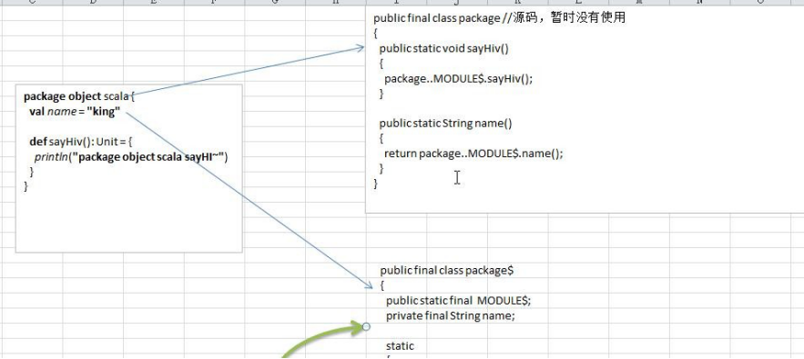

#### 包对象的注意事项

1. 每个包都可以有一个包对象。你需要在父包中定义它。
2. 包对象名称需要和包名一致，一般用来对包的功能补充

### 包的可见性问题


### Scala 中包的可见性

#### Scala 中包的可见性和访问修饰符的使用

1. 当属性访问权限为默认时， 从底层看属性是 private 的， 但是因为提供了 xxx\_\$eq()\[ 类似setter\]/xxx()\[类似 getter\] 方法，因此从使用效果看是任何地方都可以访问)

2. 当方法访问权限为默认时，默认为 public 访问权限

3. private 为私有权限，只在类的内部和伴生对象中可用 

4. protected 为受保护权限，scala 中受保护权限比 Java 中更严格，只能子类访问，同包无法访问

5. 在 scala 中没有 public 关键字,即不能用 public 显式的修饰属性和方法。

6. 包访问权限（表示属性有了限制。同时包也有了限制）

```scala
package com.hp.chapter07.visit

object Testvisit {
    def main(args: Array[String]): Unit = { 
        val c = new Clerk()
        c.showInfo() 
        Clerk.test(c)
		//创建一个 Person 对象
        val p1 = new Person 
        println(p1.name)
}
}


//类
class Clerk {
	var name: String = "jack" // 
    private var sal: Double = 9999.9 
    protected var age = 10
	var job : String = "大数据工程师"
    def showInfo(): Unit = {
        //在本类可以使用私有的
        println(" name " + name + " sal= " + sal)
    }
}
//当一个文件中出现了 class Clerk 和 object Clerk
//1. class Clerk 称为伴生类
//2. object Clerk  的伴生对象
//3. 因为 scala 设计者将 static 拿掉,  他就是设计了 伴生类和伴生对象的概念
//4. 伴生类 写非静态的内容 伴生对象 就是静态内容
object Clerk {
    def test(c: Clerk): Unit = {
        //这里体现出在伴生对象中，可以访问 
        c.sal 
        println("test() name=" + c.name + " sal= " + c.sal)
    }
}


class Person {
//这里我们增加一个包访问权限
//下面 private[visit] ： 1，仍然是 private 2.  在 visit 包(包括子包)下也可以使用 name ,相当于扩大访问范围
	protected[visit] val name = "jack"
}
```

### Scala 引入包的细节和注意事项

1. 在 Scala 中，**import 语句可以出现在任何地方，并不仅限于文件顶部**，import 语句的作用一直延伸到包含该语句的块末尾。这种语法的**好处**是：在需要时在引入包，**缩小 import 包的作用范围**，提高效率。

2. Java 中如果想要导入包中所有的类，可以通过通配符\*，Scala 中采用下 \_ 

3. 如果不想要某个包中全部的类，而是其中的几个类，可以采用选取器(大括号)

   import scala.collection.mutable.{HashMap, HashSet}

4. 如果引入的多个包中含有相同的类，那么可以将不需要的类进行重命名进行区分

   import java.util.{ HashMap=>JavaHashMap, List}

5. 如果某个冲突的类根本就不会用到，那么这个类可以直接隐藏掉

   import java.util.{ HashMap=>_, _} // 含义为 引入 java.util 包的所有类，但是忽略 HahsMap 类.

### 面向对象编程-继承

#### Scala 继承的基本语法

> class 子类名 extends 父类名 { 类体 }

```scala
//说明
//1. 在 scala 中，子类继承了父类的所有属性
//2. 但是 private 的属性和方法无法访问
object Extends02 {
def main(args: Array[String]): Unit = { 
    val sub = new Sub()
	sub.sayOk()
}
}


//父类(基类) 
class Base {
	var n1: Int = 1 //public n1() , public n1_$eq() 
    protected var n2: Int = 2
	private var n3: Int = 3 // private n3() , private n3_$eq()


    def test100(): Unit = { // 默认 public test100() 
        println("base 100")
    }


    protected def test200(): Unit = { // 
    	println("base 200")

    }
    private def test300(): Unit = { //private 
        println("base 300")
    }
}


//Sub 继承 Base
class Sub extends Base {
	def sayOk(): Unit = {
		this.n1 = 20 //这里访问本质 this.n1_$eq() 
        this.n2 = 40
        println("范围" + this.n1 + this.n2)
	test100() // 
    test200() //
}
}
```

#### 重写方法

scala 明确规定，重写一个非抽象方法需要用 override 修饰符，调用超类的方法使用super 关键字

#### Scala 中类型检查和转换

-   基本介绍

要测试某个对象是否属于某个给定的类，可以用 **isInstanceOf** 方法。用 **asInstanceOf** 方法将引用转换为子类的引用。classOf 获取对象的类名。

classOf\[String\]就如同 Java 的 String.class 。

obj.isInstanceOf\[T\]就如同 Java 的 obj instanceof T 判断 obj 是不是 T 类型。

obj.asInstanceOf\[T\]就如同 Java 的(T)obj 将 obj 强转成 T 类型。

#### Scala 中超类的构造

1. 类有一个主构器和任意数量的辅助构造器，而每个辅助构造器都必须先调用主构造器(也可以是间接调用)

2. 只有主构造器可以调用父类的构造器。辅助构造器不能直接调用父类的构造器。在 Scala 的构造器中，你不能调用 super(params)

```scala
object ScalaBaseConstrator {
def main(args: Array[String]): Unit = {
    //分析一下他的执行流程
    //1.因为 scala 遵守先构建父类部分 extends Person()
    //2.Person...
    val emp = new Emp()


    //分析一下他的执行流程
    //1.因为 scala 遵守先构建父类部分 extends Person()
    //2.Person...
    //3.Emp	(Emp 的主构造器)
    println("=====================")
    val emp2 = new Emp("mary")

    //1.Person...
    //2.默认的名字
    //3.Emp ....
    //4.Emp 辅助构造器~
    val emp3 = new Emp("smith")
    }
}


//父类 Person
class Person(pName:String) { 
    var name = pName 
    println("Person...")
    def this() {
    this("默认的名字") println("默认的名字")}
}


//子类 Emp 继承 Person
class Emp() extends Person() { println("Emp	")
//辅助构造器
    def this(name: String) {
    this // 必须调用主构造器
    this.name = name
    println("Emp 辅助构造器~")
}
}
```

#### 覆写字段

基本介绍:在 Scala 中，子类改写父类的字段，我们称为覆写/重写字段。覆写字段需使用 override 修饰。

```scala
object ScalaFiledOverride {
def main(args: Array[String]): Unit = { 
    val obj1: AAA = new BBB
    val obj2: BBB = new BBB
    //obj1.age => obj1.age() //动态绑定机制
    //obj2.age => obj2.age()
    println("obj1.age=" + obj1.age + "\t obj2.age=" + obj2.age)
}
}

class AAA {
	val age: Int = 10 // 会生成 public age()
}
class BBB extends AAA {
	override val age: Int = 20 // 会生成 public age()
}
```

反编译后的代码：

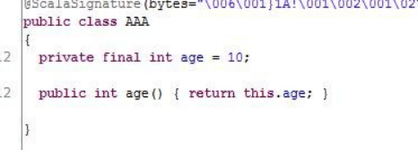

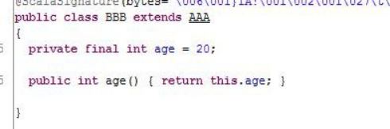

覆写字段的注意事项和细节

1)  def 只能重写另一个 def(即：方法只能重写另一个方法)

2)  val 只能重写另一个 val 属性 或 重写不带参数的 def

3)  var 只能重写另一个抽象的 var 属性

-   抽象属性：声明未初始化的变量就是抽象的属性,抽象属性在抽象类

-   var 重写抽象的 var 属性小结

    1.  一个属性没有初始化，那么这个属性就是抽象属性

    2.  抽象属性在编译成字节码文件时，属性并不会声明，但是会自动生成抽象方法，所以类必须声明为抽象类

    3.  如果是覆写一个父类的抽象属性，那么 override 关键字可省略 \[原因：父类的抽象属性， 生成的是抽象方法，因此就不涉及到方法重写的概念，因此 override 可省略\]


#### 抽象类

-   基本介绍：在 Scala 中，通过 abstract 关键字标记不能被实例化的类。方法不用标记abstract，只要省掉方法体即可。抽象类可以拥有抽象字段，抽象字段/属性就是没有初始值的字段

-   Scala 抽象类使用的注意事项和细节讨论

1. 抽象类不能被实例，必须实现

2. 抽象类不一定要包含 abstract 方法。也就是说,抽象类可以没有 abstract 方法

51. 一旦类包含了抽象方法或者抽象属性,则这个类必须声明为 abstract

52. 抽象方法不能有主体，不允许使用 abstract 修饰

53. 如果一个类继承了抽象类，则它必须实现抽象类的所有抽象方法和**抽象属性**，除非它自己也声明为 abstract 类

54. 抽象方法和抽象属性不能使用 private、final 来修饰，因为这些关键字都是和重写/实现相违背的

55. 抽象类中可以有实现的方法.

56. 子类重写抽象方法不需要 override，写上也不会错.

#### 匿名子类

-   基本介绍：和 Java 一样，可以通过包含带有定义或重写的代码块的方式创建一个匿名的子类.

# 第 7 章 面向对象编程(高级特性)

### 静态属性和静态方法

Scala 中静态的概念-伴生对象

Scala 语言是完全面向对象(万物皆对象)的语言，所以并没有静态的操作(即在 Scala 中没有静态的概念)。但是为了能够和 Java 语言交互(因为 Java 中有静态概念)，就产生了一种特殊的对象来模拟类对象，我们称之为类的伴生对象。这个类的所有静态内容都可以放置在它的伴生对象中声明和调用

### 伴生对象的小结

1.  Scala 中伴生对象采用 object 关键字声明，伴生对象中声明的全是 \"静态\"内容，可以通过伴生对象名称直接调用。

2.  伴生对象对应的类称之为伴生类，伴生对象的名称应该和伴生类名一致。

3.  伴生对象中的属性和方法都可以通过伴生对象名(类名)直接调用访问

4.  从语法角度来讲，所谓的伴生对象其实就是类的静态方法和成员的集合

5.  从技术角度来讲，scala 还是没有生成静态的内容，只不过是将伴生对象生成了一个新的类，实现属性和方法的调用。

6.  从底层原理看，伴生对象实现静态特性是依赖于 **public static final MODULE\$** 实现的。

7.  伴生对象的声明应该和伴生类的声明在同一个源码文件中(如果不在同一个文件中会运行错误!)，但是如果没有伴生类，也就没有所谓的伴生对象了，所以放在哪里就无所谓了。

8.  如果 class A 独立存在，那么 A 就是一个类， 如果 object A 独立存在，那么 A 就是一个\"静态"性质的对象\[即类对象\], 在 object A 中声明的属性和方法可以通过 A.属性 和 A.方法 来实现调用

### 伴生对象-apply 方法

在伴生对象中定义 apply 方法，可以实现： 类名(参数) 方式来创建对象实例.

### 特质

1. 从面向对象来看，接口并不属于面向对象的范畴，Scala 是纯面向对象的语言，在 Scala 中，没有接口。

2. Scala 语言中，采用特质 trait（特征）来代替接口的概念，也就是说，多个类具有相同的特征（特征）时，就可以将这个特质（特征）独立出来，采用关键字 trait 声明。理解 trait 等价于(interface + abstract class)

#### trait 的声明

trait 特质名 { trait 体}

#### Scala 中 trait 的使用

一个类具有某种特质（特征），就意味着这个类满足了这个特质（特征）的所有要素，所以在使用时，也采用了 extends 关键字，如果有多个特质或存在父类，那么需要采用 with 关键字连接

1. 没有父类：class 类名 extends 特质 1 with 特质 2 with 特质 3 ..

2. 有父类：class 类名 extends 父类 with 特质 1 with 特质 2 with 特质 3

#### 特质trait 的再说明

1. Scala 提供了特质（trait），特质可以同时拥有抽象方法和具体方法，一个类可以实现/继承多个特质。

2. 特质中没有实现的方法就是抽象方法。类通过 extends 继承特质，通过 with 可以继承多个特质

3. 所有的 java 接口都可以当做 Scala 特质使用

#### 带有特质的对象，动态混入

1. 除了可以在类声明时继承特质以外，还可以在构建对象时混入特质，扩展目标类的功能

2. 此种方式也可以应用于对抽象类功能进行扩展

3. 动态混入是 Scala 特有的方式（java 没有动态混入），可在不修改类声明/定义的情况下，扩展类的功能，非常的灵活，耦合性低 。

4. 动态混入可以在不影响原有的继承关系的基础上，给指定的类扩展功能

```scala
object MixInDemo01 {
def main(args: Array[String]): Unit = {
//在不修改 类的定义基础，让他们可以使用 trait 方法
    val oracleDB = new OracleDB with Operate3 //ocp 原则
    oracleDB.insert(100) //

	val mySQL = new MySQL3 with Operate3 
    mySQL.insert(200)

//如果一个抽象类有抽象方法，如何动态混入特质
    val mySql_ = new MySQL3_ with Operate3 {
        override def say(): Unit = { println("say")
        }
        }
    mySql_.insert(999) 
    mySql_.say()
    }
    }
trait Operate3 { //特质
def insert(id: Int): Unit = { //方法（实现） p
    rintln("插入数据 = " + id)
}
}


class OracleDB { //空
}
abstract class MySQL3 { //空
}


abstract class MySQL3_ { //空
    def say()
}
```

#### 叠加特质

基本介绍

构建对象的**同时如果混入多个特质，称之为叠加特质**，那么特质声明顺序从左到右，方法执行顺序从右到左。

叠加特质注意事项和细节

1. 特质声明顺序从左到右。

2. Scala 在执行叠加对象的方法时，会首先从后面的特质(从右向左)开始执行

3. Scala 中特质中如果调用 super，并不是表示调用父特质的方法，而是向前面（左边）继续查找特质，如果找不到，才会去父特质查找

4. 如果想要调用具体特质的方法，可以指定：**super\[特质\].xxx(...).其中的泛型必须是该特质的直接超类类**型

```scala
object AddTraits {
def main(args: Array[String]): Unit = {


    //说明
    //1. 创建 MySQL4 实例时，动态的混入 DB4 和 File4

    //研究第一个问题，当我们创建一个动态混入对象时，其顺序是怎样的
    //总结一句话
    //Scala 在叠加特质的时候，(即从左到右)
    //1.Operate4...
    //2.Data4
    //3.DB4
    //4.File4
    val mysql = new MySQL4 with DB4 with File4 println(mysql)

    //研究第 2 个问题，当我们执行一个动态混入对象的方法，其执行顺序是怎样的
    //顺序是，(1)从右到左开始执行 , 
    //(2)当执行到 super 时，是指的左边的特质 (3) 如果左边没有特质了，则 super 就是父特质
    //1. 向文件"
    //2. 向数据库
    //3. 插入数据 100 
    mysql.insert(100)


}
}


trait Operate4 { //特点
    println("Operate4...")
    def insert(id: Int) //抽象方法
}


trait Data4 extends Operate4 { //特质，继承了 Operate4 
    println("Data4")

    override def insert(id: Int): Unit = { //实现/重写 Operate4  的 insert 
        println("插入数据 = " + id)
    }
}


trait DB4 extends Data4 { //特质，继承 Data4 
    println("DB4")
    override def insert(id: Int): Unit = { // 重写 Data4 的 insert
        println("向数据库") 
        super.insert(id)
}
}


trait File4 extends Data4 { //特质，继承 Data4 
    println("File4")
    override def insert(id: Int): Unit = { // 重 写 Data4 的 insert 
        println("向文件")
        super.insert(id) //调用了 insert 方法(难点)，这里 super 在动态混入时，不一定是父类
}
}
class MySQL4	{} //普通类
```


#### 当作富接口使用的特质

富接口：即该特质中既**有抽象方法**，又有**非抽象方**法

#### 特质中的具体字段

特质中可以定义具体字段，如果初始化了就是具体字段，如果不初始化就是抽象字段。混入该特质的就具有了该字段，字段不是继承，而是直接加入类，成为自己的字段。

#### 特质中的抽象字段

特质中未被初始化的字段在具体的子类中必须被重写。

#### 特质构造顺序

特质也是有构造器的，构造器中的内容由"字段的初始化" 和一些其他语句构成。

-   第一种特质构造顺序(**声明类的同时混入特质**)

1.  调用当前类的超类构造器

2.  第一个特质的父特质构造器

3.  第一个特质构造器

4.  第二个特质构造器的父特质构造器, 如果已经执行过， 就不再执行

5.  第二个特质构造器

6.  重复 4,5 的步骤(如果有第 3 个，第 4 个特质)

7.  当前类构造器


-   第 2 种特质构造顺序(**在构建对象时，动态混入特质**)

1.  调用当前类的超类构造器

2.  当前类构造器

3.  第一个特质构造器的父特质构造器

4.  第一个特质构造器.

5.  第二个特质构造器的父特质构造器, 如果已经执行过，就不再执行

6.  第二个特质构造器

7.  重复 5,6 的步骤(如果有第 3 个，第 4 个特质)

8. 当前类构造器

-   分析两种方式对构造顺序的影响

第 1 种方式实际是构建类对象, 在混入特质时，**该对象还没有创建**。

第 2 种方式实际是构造匿名子类，可以理解成在**混入特质时，对象已经创建**了

代码演示

```scala
object MixInSeq {
def main(args: Array[String]): Unit = {
    //这时 FF 是这样 形式 class FF extends EE with CC with DD
    /*
    调用当前类的超类构造器
    第一个特质的父特质构造器第一个特质构造器
    第二个特质构造器的父特质构造器, 如果已经执行过， 就不再执行
    第二个特质构造器
    .......重复 4,5 的步骤(如果有第 3 个，第 4 个特质) 当前类构造器	[案例演示]

    */
    //1. E...
    //2. A...
    //3. B....
    //4. C....
    //5. D....
    //6. F....
    val ff1 = new FF()

    println(ff1)


    //这时我们是动态混入
    /*
    先创建 new KK 对象，然后再混入其它特质


    调用当前类的超类构造器当前类构造器
    第一个特质构造器的父特质构造器

    第一个特质构造器.
    第二个特质构造器的父特质构造器, 如果已经执行过，就不再执行第二个特质构造器
    .......重复 5,6 的步骤(如果有第 3 个，第 4 个特质) 当前类构造器	[案例演示]

    */
    //1. E...
    //2. K....
    //3. A...
    //4. B
    //5. C
    //6. D println("=======================")
    val ff2 = new KK with CC with DD println(ff2)

}
}


trait AA { println("A...")}
trait BB extends AA { println("B	")}
trait CC extends BB { println("C	")}
trait DD extends BB { println("D	")}
class EE { //普通类
    println("E	")}
class FF extends EE with CC with DD { //先继承了 EE 类，然后再继承 CC 和 DD 
    println("F	")
}
class KK extends EE { //KK 直接继承了普通类 EE 
    println("K	")
}
```

#### 扩展类的特质

-   特质可以继承类，以用来拓展该特质的一些功能

-   所有混入该特质的类，会自动成为那个特质所继承的超类的子类

-   如果混入该特质的类，已经继承了另一个类(A 类)，则要求 A 类是特质超类的子类，否则就会出现了多继承现象，发生错误

```scala
//说明
//1. LoggedException  继承了 Exception
//2. LoggedException 特质就可以	Exception 功能
trait LoggedException extends Exception { def log(): Unit = {
println(getMessage()) //  方法来自于 Exception 类
}
}


//因为 UnhappyException  继承了 LoggedException
//而 LoggedException 继承了	Exception
//UnhappyException 就成为 Exception 子类
class UnhappyException extends LoggedException{
// 已经是 Exception 的子类了，所以可以重写方法
override def getMessage = "错误消息！"
}


// 如果混入该特质的类，已经继承了另一个类(A 类)，则要求 A 类是特质超类的子类，
// 否则就会出现了多继承现象，发生错误。
class UnhappyException2 extends IndexOutOfBoundsException with LoggedException{
// 已经是 Exception 的子类了，所以可以重写方法
override def getMessage = "错误消息！"
}


class CCC {}


//错误的原因是 CCC 不是 Exception 子类
class UnhappyException3 extends CCC with LoggedException{
// 已经是 Exception 的子类了，所以可以重写方法
override def getMessage = "错误消息！"
}
```

#### 自身类型

自身类型：主要是为了解决特质的循环依赖问题，同时可以确保特质在不扩展某个类的情况下，依然可以做到限制混入该特质的类的类型。

```scala
//Logger 就是自身类型特质,当这里做了自身类型后，那么
// trait Logger extends Exception,要求混入该特质的类也是 Exception 子类
trait Logger {
// 明确告诉编译器，我就是 Exception,如果没有这句话，下面的 getMessage 不能调用
    this: Exception => def log(): Unit ={
    // 既然我就是 Exception, 那么就可以调用其中的方法
    println(getMessage)
}
}


//class Console extends	Logger {} //对吗? 错误
class Console extends Exception with Logger {}//对
```


### 嵌套类 

-   方式 1

内部类如果想要访问外部类的属性，可以通过外部类对象访问。即：访问方式：**外部类名.this.属性**名

-   方式 2

内部类如果想要访问外部类的属性，也可以通过**外部类别名访问**(推荐)。即：访问方式：外部类名别名.属性名

```scala
object ScalaInnerClassDemo {
    def main(args: Array[String]): Unit = {
        //测试 1.  创建了两个外部类的实例
        val outer1 : ScalaOuterClass = new ScalaOuterClass(); 
        val outer2 : ScalaOuterClass = new ScalaOuterClass();
        //在 scala 中，创建成员内部类的语法是
        //对象.内部类 方式创建, 这里语法可以看出在 scala 中，默认情况下内部类实例和外部对象关联
		val inner1 = new outer1.ScalaInnerClass 
        val inner2 = new outer2.ScalaInnerClass


        inner1.info()

		//创建静态内部类实例
		val staticInner= new ScalaOuterClass.ScalaStaticInnerClass()
}
}

//外部类
//内部类访问外部类的属性的方法 1  外部类名.this.属性
//class ScalaOuterClass {
//	//定义两个属性
//	var name = "scoot"
//	private var sal = 30000.9
//
//	class ScalaInnerClass { //成员内部类,
//

//	def info() = {
//	// 访问方式：外部类名.this.属性名
//	// 怎么理解 ScalaOuterClass.this 就相当于是 ScalaOuterClass 这个外部类的一个实例,
//	// 然后通过 ScalaOuterClass.this  实例对象去访问 name 属性
//	// 只是这种写法比较特别，学习 java 的同学可能更容易理解 ScalaOuterClass.class 的写法.
//	println("name = " + ScalaOuterClass.this.name
//	+ " sal =" + ScalaOuterClass.this.sal)
//	}
//	}
//
//}


//外部类
//内部类访问外部类的属性的方法 2  使用别名的方式
//1. 将外部类属性，写在别名后面
class ScalaOuterClass {
myouter => //这里我们可以这里理解 外部类的别名 看做是外部类的一个实例
    class ScalaInnerClass { //成员内部类,

        def info() = {
        // 访问方式：外部类别名.属性名
        // 只是这种写法比较特别，学习 java 的同学可能更容易理解 ScalaOuterClass.class 的写法. 
            println("name~ = " + myouter.name
        + " sal~ =" + myouter.sal)

        }
        }
    //定义两个属性var name = "jack"
    private var sal = 800.9
}


object ScalaOuterClass { //伴生对象
class ScalaStaticInnerClass { //静态内部类
}
}
```


### 类型投影

类型投影是指：在方法声明上，如果使用 外部类\#内部类 的方式，表示忽略内部类的对象关系， 等同于 Java 中内部类的语法操作，我们将这种方式称之为 类型投影（即：忽略对象的创建方式， 只考虑类型）

```scala
def test(ic: ScalaOuterClass#ScalaInnerClass): Unit = { 
    System.out.println("使用了类型投影" + ic)
}

```

# 第 8 章 隐式转换和隐式值

### 隐式转换

#### 隐式函数基本介绍

隐式转换函数是以 implicit 关键字声明的带有单个参数的函数。这种函数将会自动应用，将值从一种类型转换为另一种类型

```scala
object ImplicitDemo01 {
def main(args: Array[String]): Unit = {


    //编写一个隐式函数转成 Double->Int 转换
    //隐式函数应当在作用域才能生效
    implicit def f1(d:Double): Int = { //底层 生成 f1$1 d.toInt
    }


    val num: Int = 3.5 // 底层编译 f1$1(3.5) //idea  	
    println("num =" + num)


}
}
```

#### 隐式转换的注意事项和细节

1.  隐式转换函数的函数名可以是任意的，隐式转换与函数名称无关，只与**函数签名（函数参数类型和返回值类型）有关**。

2. 隐式函数可以有多个(即：隐式函数列表)，但是需要保证在当前环境下，只有一个隐式函数能被识别

   


#### 隐式转换丰富类库功能

```scala
object ImplicitDemo02 {
    def main(args: Array[String]): Unit = {

    //编写一个隐式函数，丰富 mySQL 功能
    implicit def addDelete(msql:MySQL): DB = { new DB}


     //创建 mysql 对象
     val mySQL = new MySQL 
     mySQL.insert()
     mySQL.delete() //  编译器工作 分析 addDelete$1(mySQL).delete()
     mySQL.update()


}
}
class MySQL {
	def insert(): Unit = { println("insert")}
}


class DB {
	def delete(): Unit = { println("delete")
}


	def update(): Unit = { println("update")
}
}

```


### 隐式值

隐式值也叫隐式变量，将某个形参变量标记为 implicit，所以编译器会在方法省略隐式参数的情况下去搜索作用域内的隐式值作为缺省参数

 编译器的优先级为 传值 \> 隐式值 \> 默认值

 在隐式值匹配时，不能有二义性

 如果三个 （隐式值，默认值，传值） 一个都没有，就会报错

### 隐式类

在 scala2.10 后提供了隐式类，可以使用 implicit 声明类，隐式类的非常强大，同样可以扩展类的功能，比前面使用隐式转换丰富类库功能更加的方便，在集合中隐式类会发挥重要的作用。

#### 隐式类使用有如下几个特点：

1. 其所带的构造参数有且只能有一个

2. 隐式类必须被定义在"**类"或"伴生对象"或"包对象**"里，即隐式类不能是顶级的(top-level objects)。

3. 隐式类不能是 case class（样例类）

4. 作用域内不能有与之相同名称的标识符

```scala
object ImplicitClassDemo {
    def main(args: Array[String]): Unit = {
    //DB1 会对应生成隐式类
    //DB1 是一个隐式类,  当我们在该隐式类的作用域范围，创建 MySQL1 实例
    //该隐式类就会生效, 这个工作仍然编译器完成
    //看底层..
		implicit class DB1(val m: MySQL1) { //ImplicitClassDemo$DB1$2 
            def addSuffix(): String = { m + " scala"}
	}


    //创建一个 MySQL1 实例
    val mySQL = new MySQL1 
    mySQL.sayOk() //本身
    mySQL.addSuffix() //研究 如何关联到 DB1$1(mySQL).addSuffix();

}
}

class DB1 {}

class MySQL1 {
def sayOk(): Unit = { println("sayOk")
}
}
```


### 隐式的转换时机

1)  当方法中的参数的类型与目标类型不一致时, 或者是赋值时。

2)  当对象调用所在类中不存在的方法或成员时，编译器会自动将对象进行隐式转换（根据类型）

#### 隐式解析机制

解析具有以下两种规则：

1)  首先会在当前代码作用域下查找隐式实体（隐式方法、隐式类、隐式对象）。(一般是这种情况)

2)  如果第一条规则查找隐式实体失败，会继续在隐式参数的类型的作用域里查找。类型的作用域是指与该类型相关联的全部伴生模块，一个隐式实体的类型T 它的查找范围如下(**第二种情况范围广且复杂在使用时，应当尽量避免出现**)：

a)  如果 T 被定义为 T with A with B with C,那么 A,B,C 都是 T 的部分，在 T 的隐式解析过程中， 它们的伴生对象都会被搜索。

b)  如果 T 是参数化类型，那么类型参数和与类型参数相关联的部分都算作 T 的部分，比如List\[String\]的隐式搜索会搜索 List 的伴生对象和 String 的伴生对象。

c)  如果 T 是一个单例类型 p.T，即 T 是属于某个 p 对象内，那么这个 p 对象也会被搜索。

d)  如果 T 是个类型注入 S\#T，那么 S 和 T 都会被搜索

### 在进行隐式转换时，需要遵守两个基本的前提：

1)  不能存在二义性

2)  隐式操作不能嵌套使用 

implicit def f1(d: Double): Int = { 

​	d.toInt

​	val num2:Int = 2.3 //底层 f1$1(2.3) //f1$1 对应的就是 f1,就会形成递归

}

# 第 9 章数据结构(上)-集合

1.  Scala 同时支持不可变集合和可变集合，不可变集合可以安全的并发访问两个主要的包：不可变集合：scala.collection.immutable 可变集合： scala.collection.mutable

2.  Scala 默认采用不可变集合，对于几乎所有的集合类，Scala 都同时提供了可变(mutable)和不可变(immutable)的版本

3.  Scala 的集合有三大类：序列 Seq(有序的,Linear Seq)、集 Set、映射 Map【key-\>value】，所有的集合都扩展自 Iterable 特质，在 Scala 中集合有可变（mutable）和不可变（immutable）两种类型。

4.  不可变集合：scala 不可变集合，就是这个**集合本身不能动态变化**。(类似 java 的数组，是不可以动态增长的)

5.  可变集合:可变集合，就是这个**集合本身可以动态变化的**。(比如:ArrayList , 是可以动态增长的)


### 不可变集合继承层次一览图

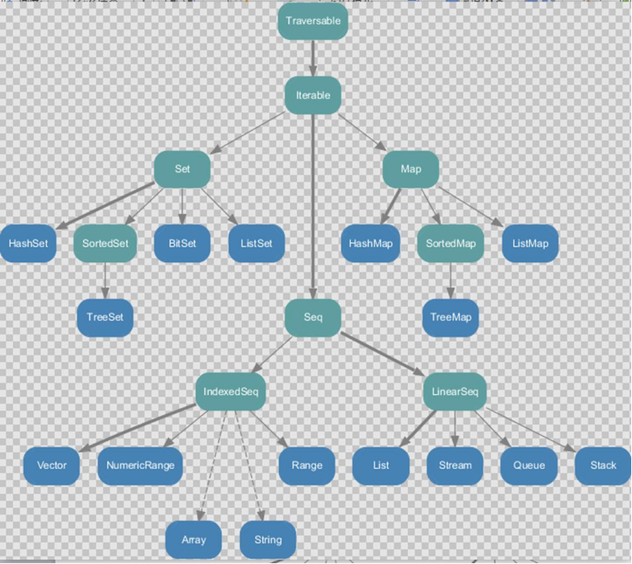


1. Set、Map 是 Java 中也有的集合

2. Seq 是 Java 没有的，List 归属到 Seq 了,因此这里的 List 就和 java 不是同一个概念了

3. 前面的 for 循环有一个 1 to 3 ,就是 IndexedSeq 下的 Vector 4. String 也是属于 IndexeSeq

4. 经典的数据结构比如 Queue 和 Stack 被归属到 LinearSeq

5.  Scala 中的 Map 体系有一个 SortedMap,说明 Scala 的 Map 可以支持排序

6. IndexSeq 和 LinearSeq 的区别\[IndexSeq 是通过索引来查找和定位，因此速度快，比如 String 就是一个索引集合，通过索引即可定位\] \[LineaSeq 是线型的，即有头尾的概念，这种数据结构一般是通过遍历来查找，它的价值在于应用到一些**具体的应用场景** (电商网站, 大数据推荐系统 :最近浏览的 10 个商品)

### 可变集合继承层次一览图

**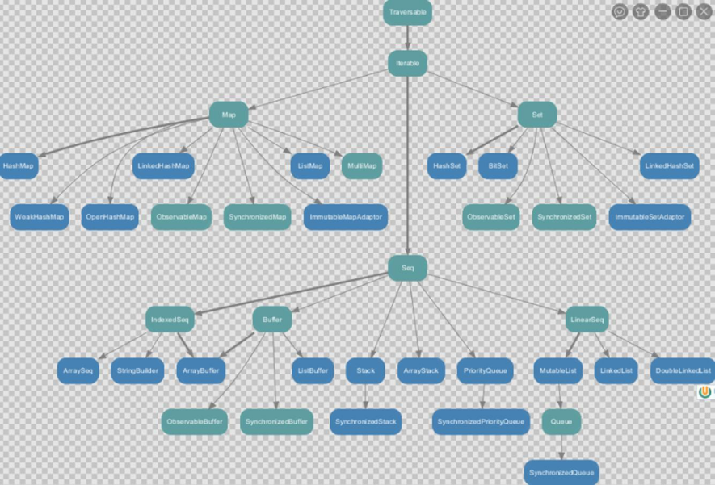**


1. 在可变集合中比不可变集合更加丰富

2. 在 Seq 集合中， 增加了 Buffer 集合，将来开发中，我们常用的有 ArrayBuffer 和 ListBuffer

3. 如果涉及到线程安全可以选择使用 syn.. 开头的集合

### 数组-定长数组

#### 第一种方式定义数组

这里的数组等同于 Java 中的数组,中括号的类型就是数组的类型

val arr1 = new Array\[Int\](10)

//赋值,集合元素采用小括号访问arr1(1) = 7

#### 第二种方式定义数组

在定义数组时，直接赋值

//使用 apply 方法创建数组对象

val arr1 = Array(1, 2)

### 数组-变长数组

val arr2 = ArrayBuffer\[Int\]()

//追加值/元素arr2.append(7)

//重新赋值arr2(0) = 7

//使用 append 追加数据 ,append 支持可变参数

arr2.remove(0) 

##### 变长数组分析小结

1. ArrayBuffer 是变长数组，类似 java 的 ArrayList

2. val arr2 = ArrayBuffer\[Int\]() 也是使用的 apply 方法构建对象

3. def append(elems: A\*) { appendAll(elems) } 接收的是可变参数.

4. 每 append 一次，arr 在底层会重新分配空间，进行扩容，arr2 的内存地址会发生变化，也就成为新的 ArrayBuffer

### 定长数组与变长数组的转换

arr2.toArray 返回结果才是一个定长数组， arr2 本身没有变化

arr1.toBuffer 返回结果才是一个可变数组， arr1 本身没有变化

底层的实现

> override def toBuffer\[A1 \>: A\]: mutable.Buffer\[A1\] = {
>
>  val result = new mutable.ArrayBuffer\[A1\](size) 
>
> copyToBuffer(result)
>
> result
>
> }
>

### 多维数组的定义和使用

val arr = Array.ofDim\[Double\](3,4)

### 数组-Scala 数组与Java 的 List 的互转

```scala
import scala.collection.mutable.ArrayBuffer

object ArrayBuffer2JavaList {
	def main(args: Array[String]): Unit = {
	// Scala 集合和 Java 集合互相转换
	val arr = ArrayBuffer("1", "2", "3")
        /*
        implicit def bufferAsJavaList[A](b : scala.collection.mutable.Buffer[A]) 
        : java.util.List[A] = { /* compiled code */ }
        */
	import scala.collection.JavaConversions.bufferAsJavaList
	//对象 ProcessBuilder  ， 因为 这里使用到上面的	bufferAsJavaList
	val javaArr = new ProcessBuilder(arr) //为什么可以这样使用?
	// 这里 arrList 就是 java 中的 List 
    val arrList = javaArr.command()
	println(arrList) //输出 [1, 2, 3]
}
}

//java 的 List 转成 scala 的 ArrayBuffer
//说明
//1. asScalaBuffer 是一个隐式函数
/*
implicit def asScalaBuffer[A](l : java.util.List[A]) : scala.collection.mutable.Buffer[A] = { /* compiled code */ }
*/
import scala.collection.JavaConversions.asScalaBuffer 
import scala.collection.mutable
// java.util.List ==> Buffer
val scalaArr: mutable.Buffer[String] = arrList 
scalaArr.append("jack") 
scalaArr.append("tom")
scalaArr.remove(0)
println(scalaArr) // (2,3,jack,tom)
```

### 元组 Tuple-元组的基本使用

元组也是可以理解为一个容器，可以存放各种相同或不同类型的数据。元组中最大只能有 22 个元素

元组中最大只能有 22 个元素 即 Tuple1\...Tuple22

访问元组中的数据,可以采用顺序号（_顺序号），也可以通过索引（productElement）访问。

```scala
println("==================访问元组=========================")
//访问元组
val t1 = (1, "a", "b", true, 2)
println(t1._1) // 1 //访问元组的第一个元素 ，从 1 开始


/*
override def productElement(n: Int) = n match { case 0 => _1
case 1 => _2 case 2 => _3 case 3 => _4 case 4 => _5
case _ => throw new IndexOutOfBoundsException(n.toString())
}
*/
println(t1.productElement(0))	// 0 // 访问元组的第一个元素，从 0 开始

println("==================遍历元组=========================")
//遍历元组, 元组的遍历需要使用到迭代器
for (item <- t1.productIterator) {
    println("item=" + item)
}
```

### 列表 List

Scala 中的 List 和 Java List 不一样，在 Java 中 List 是一个接口，真正存放数据是 ArrayList，而 Scala的 List 可以直接存放数据，就是一个 object，默认情况下 Scala 的 List 是不可变的，List 属于序列 Seq。

```scala
println("-------------list 追加元素后的效果	")
//通过 :+ 和 +: 给 list 追加元素(本身的集合并没有变化) 
var list1 = List(1, 2, 3, "abc")
// :+运算符表示在列表的最后增加数据
val list2 = list1 :+ 4 // (1,2,3,"abc", 4)
println(list1) //list1 没有变化 (1, 2, 3, "abc"),说明 list1 还是不可变
println(list2) //新的列表结果是 [1, 2, 3, "abc", 4]

val list3 = 10 +: list1 // (10,1, 2, 3, "abc") 
println("list3=" + list3)

1)符号::表示向集合中	新建集合添加元素。
2)运算时，集合对象一定要放置在最右边，
3)运算规则，从右向左。
4)::: 运算符是将集合中的每一个元素加入到集合中去
//:: 符号的使用
val list4 = List(1, 2, 3, "abc")

//1. List()
//2. List(List(1, 2, 3, "abc"))
//3. List(6,List(1, 2, 3, "abc"))
//4. List(5,6,List(1, 2, 3, "abc"))
//5. List(4,5,6,List(1, 2, 3, "abc")) 
val list5 = 4 :: 5 :: 6 :: list4 :: Nil 
println("list5=" + list5)

//说明 val list6 = 4 :: 5 :: 6 :: list4 ::: Nil 步骤
//1. List()
//2. List(1, 2, 3, "abc")
//3. List(6,1, 2, 3, "abc")
//4. List(5,6,1, 2, 3, "abc")
//5. List(4,5,6,1, 2, 3, "abc")
val list6 = 4 :: 5 :: 6 :: list4 ::: Nil 
println("list6=" + list6)
```

List 中可以放任何数据类型，比如 arr1 的类型为 List\[Any\]

如果希望得到一个空列表，可以使用 Nil 对象, 在 scala 包对象声明的,因此不需要引入其它包也可以使用

### ListBuffer

ListBuffer 是可变的 list 集合，可以添加，删除元素,ListBuffer 属于序列

```scala
object ListBufferDemo01 {
	def main(args: Array[String]): Unit = {//创建 ListBuffer
        val lst0 = ListBuffer[Int](1, 2, 3)
		//如何访问
		println("lst0(2)=" + lst0(2)) // 输出 lst0(2)= 3 
        for (item <- lst0) { // 遍历，是有序
			println("item=" + item)}


	//动态的增加元素，lst1 就会变化,  增加一个一个的元素
	val lst1 = new ListBuffer[Int] //空的 ListBuffer 
    lst1 += 4 // lst1 (4)
	lst1.append(5) // list1(4,5)
	//
	lst0 ++= lst1 // lst0 (1, 2, 3,4,5)
	val lst2 = lst0 ++ lst1 // lst2(1, 2, 3,4,5,4,5) 
    println("lst2=" + lst2)
	val lst3 = lst0 :+ 5 // lst0 不变 lst3(1, 2, 3,4,5,5) 
    println("lst3=" + lst3)

	lst1.remove(1) // 表示将下标为 1 的元素删除
}
}
```


### 队列 Queue-基本介绍

队列的说明

1. 队列是一个**有序列表**，在底层可以用**数组**或是**链表**来实现。

2. 其输入和输出要遵循**先入先出的原则**。即：先存入队列的数据，要先取出。后存入的要后取

3. 在 Scala 中，由设计者直接给我们提供队列类型 Queue 使用。

4. 在 scala 中, 有 scala.collection.mutable.Queue 和 scala.collection.immutable.Queue , 一般来说，我们在开发中通常使用可变集合中的队列。

```scala
val q1 = new mutable.Queue[Int] 
q1 += 9 // (9)
println("q1=" + q1) // (9)
q1 ++= List(4,5,7) // 默认值直接加在队列后面
println("q1=" + q1) //(9,4,5,7)
//q1 += List(10,0) // 表示将 List(10,0) 作为一个元素加入到队列中,
//dequeue 从队列的头部取出元素 q1 本身会变
val queueElement = q1.dequeue() 
println("queueElement=" + queueElement + "q1="+q1)
//enQueue 入队列，默认是从队列的尾部加入.
q1.enqueue(100,10,100,888)
println("q1=" + q1) // Queue(4, 5, 7, 100,10,100,888)


//1. 获取队列的第一个元素
println(q1.head) // 4, 对 q1 没有任何影响
//2. 获取队列的最后一个元素
println(q1.last) // 888, 对 q1 没有任何影响
//3. 取出队尾的数据 ,即：返回除了第一个以外剩余的元素，可以级联使用
println(q1.tail) // (5, 7, 100,10,100,888)
println(q1.tail.tail.tail.tail) // (10,100,888)
```

### 映射 Map-基本介绍

Scala 中的 Map 和 Java 类似，也是一**个散列表**，它存储的内容也是键值对(key-value)映射，Scala 中**不可变的 Map 是有序的**，**可变的 Map 是无序的**。

Scala 中的不可变 Map 是有序，构建 Map 中的元素底层是 Tuple2 类型。

Scala 中的不可变 Map 是有序，构建 Map 中的元素底层是 Tuple2 类型。

```scala
//方式 1-构造不可变映射
//1.默认 Map 是 immutable.Map
//2.key-value 类型支持 Any
//3.在 Map 的底层，每对 key-value 是 Tuple2
//4.从输出的结果看到，输出顺序和声明顺序一致
val map1 = Map("Alice" -> 10, "Bob" -> 20, "Kotlin" -> "北京") 
println(map1)

//方式 2-构造可变映射
//1.从输出的结果看到，可变的 map 输出顺序和声明顺序不一致
val map2 = mutable.Map("Alice" -> 10, "Bob" -> 20, "Kotlin" -> "北京")
//方式3
val map3 = new scala.collection.mutable.HashMap[String, Int] 
println(map3)
//方式 4-对偶元组
val map4 = mutable.Map(("Alice" , 10), ("Bob" , 20), ("Kotlin" , "北京")) println("map4=" + map4)
```

#### 映射 Map-取值

1. 使用map(key)

   val value1 = map2(\"Alice\") println(value1)

   如果 key 存在，则返回对应的值

   如果 key 不存在，则抛出异常\[java.util.NoSuchElementException\]

   在 Java 中,如果 key 不存在则返回 null

2. 使用contains 方法检查是否存在key

   返回 Boolean

   如果 key 存在，则返回 true

   如果 key 不存在，则返回 false map4.contains(\"B\")

   使用 containts 先判断在取值，可以防止异常，并加入相应的处理逻辑

3. 使用map.get(key).get 取值

   通过 映射.get(键) 这样的调用返回一个 Option 对象，要么是 Some，要么是 None

   map.get 方法会将数据进行包装

   如果 map.get(key) key 存在返回 some,如果 key 不存在，则返回 None

   如 果 map.get(key).get key 存 在 ， 返 回 key 对 应 的 值 , 否 则 ， 抛 出 异 常java.util.NoSuchElementException: None.get

4. 使用map4.getOrElse()取值

   getOrElse 方法 : def getOrElse\[V1 \>: V\](key: K, default: =\> V1)

   如果 key 存在，返回 key 对应的值。

   如果 key 不存在，返回默认值。在

#### 如何选择取值的方式

1. 如果我们确定 map 有这个 key ,则应当使用 map(key), 速度快

2. 如果我们不能确定map 是否有 key ,而且有不同的业务逻辑，使用 map.contains() 先判断在加入逻辑

4. 如果只是简单的希望得到一个值，使用 map4.getOrElse(\"ip\",\"127.0.0.1\")

#### 映射 Map-对 map 修改、添加和删除

##### 更新map 的元素

1. map 是可变的，才能修改，否则报错

2. 如果 **key 存在：则修改**对应的值,**key 不存在,等价于添加**一个 key-val

   ```scala
   val map5 = mutable.Map( ("A", 1), ("B", "北京"), ("C", 3) ) 
   map5("A") = 20 //增加
   println("map5=" + map5)
   ```

##### 添加map 元素

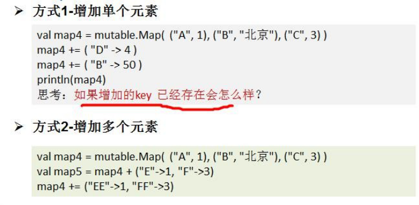

说明: 当增加一个 key-value ,如果 key 存在就是更新，如果不存在，这是添加

##### 删除map 元素

```
map5 -= ("A","B","AAA") //
println("map5=" + map5)
```

1. "A\",\"B\" 就是要删除的 key, 可以写多个.

2. 如果 key 存在，就删除，如果 key 不存在，也不会报错.

#### 映射 Map-对 map 遍历

```scala
val map1 = mutable.Map( ("A", 1), ("B", "北京"), ("C", 3) )
for ((k, v) <- map1) println(k + " is mapped to " + v) 
for (v <- map1.keys) println(v)
for (v <- map1.values) println(v)
for(v <- map1) println(v) //v 是 Tuple

```

###  Set

是**不重复元素的结合**。集**不保留顺序**，默认是以**哈希**集实现

默 认 情 况 下 ， Scala 使 用 的 是 不 可 变 集 合 ， 如 果 你 想 使 用 可 变 集 合 ， 需 要 引 用scala.collection.mutable.Set 包

```scala
val set = Set(1, 2, 3) //不可变
val set2 = mutable.Set(1,2,"hello") //可以变
mutableSet.add(4) //方式 1
mutableSet += 6	//方式 2
mutableSet.+=(5) //方式 3
val set02 = mutable.Set(1,2,4,"abc") 
set02 -= 2 //  操作符形式
set02.remove("abc") // 方法的形式，scala 的 Set 可以直接删除值
//如果删除的对象不存在，则不生效，也不会报错
val set02 = mutable.Set(1, 2, 4, "abc") 
for(x <- set02) {
println(x)
}
```


# 第 10 章数据结构(下)-集合操作

### 集合元素的映射-map 映射操作

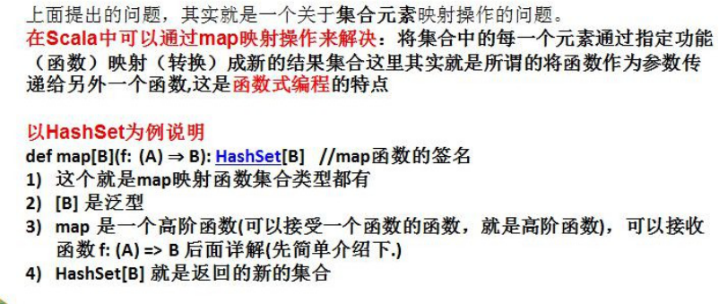

### flatmap 映射

flatmap：flat 即压扁，压平，扁平化，效果就是将集合中的每个元素的子元素映射到某个函数并返回新的集合。

```scala
object FlatMapDemo01 {
def main(args: Array[String]): Unit = {
    val names = List("Alice", "Bob", "Nick")
	//需求是将 List 集合中的所有元素，进行扁平化操作，即把所有元素打散
	val names2 = names.flatMap(upper) 
    println("names2=" + names2)

}
def upper( s : String ) : String = {
s. toUpperCase
}
}
```

### 集合元素的过滤-filter

filter：将符合要求的数据(筛选)放置到新的集合中

```scala
object FilterDemo01 {
def main(args: Array[String]): Unit = {
    /*
    选出首字母为 A 的元素
    */
    val names = List("Alice", "Bob", "Nick") 
    val names2 = names.filter(startA) 	
    println("names=" + names) 
    println("names2=" + names2)
}

def startA(str:String): Boolean = { str.startsWith("A")
}
}
```

### reduceLeft 

1.  def reduceLeft\[B \>: A\](\@deprecatedName(\'f) op: (B, A) =\> B): B
2.  reduceLeft(f) 接收的函数需要的形式为 op: (B, A) =\> B): B
3.  reduceleft(f) 的运行规则是 从左边开始执行将得到的结果返回给第一个参数
4.  然后继续和下一个元素运行，将得到的结果继续返回给第一个参数，继续.

```scala
object ReduceDemo01 {
def main(args: Array[String]): Unit = {
    /*
    使用化简的方式来计算 list 集合的和
    */
    val list = List(1, 20, 30, 4, 5)
    val res = list.reduceLeft(sum) // reduce/reduceLeft/reduceRight


    //执行的流程分析
    //步骤 1 (1 + 20)
    //步骤 2 (1 + 20) + 30
    //步骤 3 ((1 + 20) + 30) + 4
    //步骤 4 (((1 + 20) + 30) + 4) + 5 = 60


    println("res="+res) // 60


}
    def sum(n1: Int, n2: Int): Int = {
        println("sum 被调用~~") n1 + n2
}
}
```

### fold

fold 函数将上一步返回的值作为函数的第一个参数继续传递参与运算，直到 list 中的所有元素被遍历。

可以把 reduceLeft 看做简化版的 foldLeft。如何理解:

> def reduceLeft\[B \>: A\](\@deprecatedName(\'f) op: (B, A) =\> B): B =
>
> if (isEmpty) throw new UnsupportedOperationException(\"empty.reduceLeft\") else tail.foldLeft\[B\](head)(op)
>
> reduceLeft 就是调用的foldLeft\[B\](head)，并且是默认从集合的 head 元素开始操作的。

相关函数：fold，foldLeft，foldRight，可以参考 reduce 的相关方法理解

#### foldLeft 和foldRight 缩写方法分别是：/:和:\\

### scan

扫描，即对某个集合的所有元素做 fold 操作，但是会把产生的**所有中间结果放置于一个集合**中保存

```scala
object ScanDemo01 {
def main(args: Array[String]): Unit = {
//普通函数
    def minus( num1 : Int, num2 : Int ) : Int = { num1 - num2
    }


    //5 (1,2,3,4,5) =>(5, 4, 2, -1, -5, -10) //Vector(5, 4, 2, -1, -5, -10)
    val i8 = (1 to 5).scanLeft(5)(minus) //IndexedSeq[Int] println("i8=" + i8)

    //普通函数
    def add( num1 : Int, num2 : Int ) : Int = { num1 + num2
    }
    //(1,2,3,4,5) 5 => (20,19,17,14, 10,5)
    val i9 = (1 to 5).scanRight(5)(add) //IndexedSeq[Int] println("i9=" + i9)

}
}
```

### zip

在开发中，当我们需要将两个集合进行 **对偶元组合并**，可以使用拉链。

拉链的使用注意事项

1. 拉链的本质就是两个集合的合并操作，合并后每个元素是一个 对偶元组。

2. 如果两个集合个数不对应，会造**成数据丢失**。

3. 集合不限于 List, 也可以是其它集合比如 Array

4. 如果要取出合并后的各个对偶元组的数据，可以遍历

```scala
object ZipDemo01 {
def main(args: Array[String]): Unit = {
// 拉链
    val list1 = List(1, 2, 3)
    val list2 = List(4, 5, 6)
    val list3 = list1.zip(list2) // (1,4),(2,5),(3,6) 
    println("list3=" + list3)

}
}
```

### 迭代器

通过 iterator 方法从集合获得一个迭代器，通过 while 循环和 for 表达式对集合进行遍历.(学习使用迭代器来遍历)

iterator 的构建实际是 AbstractIterator 的一个匿名子类，该子类提供了

> /\*
>
> def iterator: Iterator\[A\] = new AbstractIterator\[A\] { var these = self
>
> def hasNext: Boolean = !these.isEmpty def next(): A =
>
> \*/

该 AbstractIterator 子类提供了 hasNext next 等方法.

因此，我们可以使用 while 的方式，使用 hasNext next 方法变量

```scala
object IteratorDemo01 {
def main(args: Array[String]): Unit = {
    val iterator = List(1, 2, 3, 4, 5).iterator // 得到迭代器
    /*
    这里我们看看 iterator 的继承关系
    def iterator: Iterator[A] = new AbstractIterator[A] { var these = self
    def hasNext: Boolean = !these.isEmpty def next(): A =
    if (hasNext) {
    val result = these.head; these = these.tail; result
    } else Iterator.empty.next()
    */
    println("--------遍历方式 1 while	")
    while (iterator.hasNext) { println(iterator.next())
    }
    println("--------遍历方式 2 for	")
    for(enum <- iterator) { println(enum) //
    }
}
}
```

### 流 Stream

stream 是一个集合。这个集合，可以用于存放**无穷多个元素**，但是这无穷个元素并不会一次性生产出来，而是需要用到多大的区间，就会动态的生产，**末尾元素遵循 lazy 规则**(即：要使用结果才进行计算的) 。

```scala
//1)Stream 集合存放的数据类型是 BigInt
//2)numsForm 是自定义的一个函数，函数名是程序员指定的。
//3)创建的集合的第一个元素是 n , 后续元素生成的规则是 n + 1
//4)后续元素生成的规则是可以程序员指定的 ，比如 numsForm( n * 4)...
//创建 Stream
def numsForm(n: BigInt) : Stream[BigInt] = n #:: numsForm(n + 1) 
val stream1 = numsForm(1)
println(stream1) //
//取出第一个元素
println("head=" + stream1.head) //
println(stream1.tail) // 当对流执行 tail 操作时，就会生成一个新的数据. 
println(stream1) //
```

### 视图 View

view 方法产出一个总是**被懒执行的集合**。

view 不会缓存数据，每次都要重新计算，比如遍历 View 时。

```scala
object ViewDemo01 {
def main(args: Array[String]): Unit = {

	def multiple(num: Int): Int = { num}


	//如果这个数，逆序后和原来数相等，就返回 true,否则返回 false 
    def eq(i: Int): Boolean = {
		println("eq 被 调 用 ..") 
        i.toString.equals(i.toString.reverse)
	}
    //说明: 没有使用 view,常规方式
    val viewSquares1 = (1 to 100).filter(eq) 
    println(viewSquares1)


    //使用 view，来完成这个问题,程序中，对集合进行 map,filter,reduce,fold...
    //你并不希望立即执行，而是在使用到结果才执行，则可以使用 view 来进行优化. 
    val viewSquares2 = (1 to 100).view.filter(eq)
    println(viewSquares2)
    //遍历
    for (item <- viewSquares2) { println("item=" + item)
    }
}
}
```

### 并行集合

Scala 为了充分使用多核 CPU，提供了并行集合（有别于前面的串行集合），用于多核环境的并行计算。

主要用到的算法有：

Divide and conquer : 分治算法，Scala 通过 splitters(分解器)，combiners（组合器）等抽象层来实现， 主要原理是将计算工作分解很多任务，分发给一些处理器去完成，并将它们处理结果合并返回

Work stealin 算法【学数学】，主要用于任务调度负载均衡（load-balancing），通俗点完成自己的所有任务之后，发现其他人还有活没干完，主动（或被安排）帮他人一起干，这样达到尽早干完的目的

```scala
object ParDemo02 {
def main(args: Array[String]): Unit = {


    val result1 = (0 to 100).map{case _ => Thread.currentThread.getName}.distinct
    val result2 = (0 to 100).par.map{case _ => Thread.currentThread.getName}.distinct 
    println(result1) //非并行
    println("	")
    println(result2) //并行
}
}
```

# 第 11 章模式匹配

### match

Scala 中的模式匹配类似于 Java 中的 switch 语法，但是更加强大。

模式匹配语法中，采用 match 关键字声明，每个分支采用 case 关键字进行声明，当需要匹配时， 会从第一个 case 分支开始，如果匹配成功，那么执行对应的逻辑代码，如果匹配不成功，继续执行下一个分支进行判断。如果所有 case 都不匹配，那么会执行 case \_ 分支，类似于 Java 中 default 语句。

#### match 的细节和注意事项

1.  如果所有 case 都不匹配，那么会执行 case \_ 分支，类似于 Java 中 default 语句

2.  如果所有 case 都不匹配，又没有写 case \_ 分支，那么会抛出 MatchError

3.  每个 case 中，不用 break 语句，自动中断 case

4.  可以在 match 中使用其它类型，而不仅仅是字符

### 守卫

如果想要表达匹配某个范围的数据，就需要在模式匹配中增加条件守卫

```scala
object MatchIfDemo01 {
    def main(args: Array[String]): Unit = { 
        for (ch <- "+-3!") { //是对"+-3!" 遍历

            var sign = 0 
            var digit = 0 
            ch match {
                case '-' => sign = -1
                // 说明..
                // 如果 case 后有 条件守卫即 if ,那么这时的 _  不是表示默认匹配
                // 表示忽略 传入 的 ch
                case _ if ch.toString.equals("3") => digit = 3
                case _ if (ch > 1110 || ch < 120) => println("ch > 10") 
                case _ => sign = 2
            }
            //分析
            // + 1 0
            // - -1 0
            // 3 0 3
            // ! 2 0
            println(ch + " " + sign + " " + digit)
    }
        val obj = if (a == 1) 1 
        else if (a == 2) "2"
        else if (a == 3) BigInt(3)
        else if (a == 4) Map("aa" -> 1) 
        else if (a == 5) Map(1 -> "aa") 
        else if (a == 6) Array(1, 2, 3) 
        else if (a == 7) Array("aa", 1) 
        else if (a == 8) Array("aa")

        //说明
        //1. 根据	obj 的类型来匹配
        // 返回值
        val result = obj match {
            case a: Int => a
            case b: Map[String, Int] => "对象是一个字符串-数字的 Map 集合" 
            case c: Map[Int, String] => "对象是一个数字-字符串的 Map 集合"
            case d: Array[String] => d //"对象是一个字符串数组" 
            case e: Array[Int] => "对象是一个数字数组"
            case f: BigInt => Int.MaxValue 
            case _ => "啥也不是"
}
}
}

```


### 匹配数组

1. Array(0) 匹配只有一个元素且为 0 的数组。

2. Array(x,y) 匹配数组有两个元素，并将两个元素赋值为 x 和y。当然可以依次类推 Array(x,y,z) 匹配数组有 3 个元素的等等\....

4. Array(0,\_\*) 匹配数组以 0 开始

```scala
import scala.collection.mutable.ArrayBuffer


object MatchArr {
def main(args: Array[String]): Unit = {
    //	val arrs = Array(Array(0), Array(1, 0), Array(0, 1, 0),
    //	Array(1, 1, 0), Array(1, 1, 0, 1))
    //
    //	for (arr <- arrs ) {
    //	val result = arr match {
    //	case Array(0) => "0"
    //	case Array(x, y) => x + "=" + y
    //	case Array(0, _*) => "以 0 开头和数组"
    //	case _ => "什么集合都不是"
    //	}
    //	// result = 0
    //	// result = 1 = 0
    //	// result = 以 0 开头和数组
    //	// result = 什么集合都不是
    //	// result = 什么集合都不是
    //	println("result = " + result)
    //	}


	//给你一个数组集合，如果该数组时	Array(10,20) ,  请使用默认匹配，返回 Array(20,10)


    val arrs2 = Array(Array(0), Array(1, 0), Array(0, 1, 0),Array(1, 1, 0), Array(1, 1, 0, 1))
    for (arr <- arrs2 ) {
    val result = arr match {
        case Array(0) => "0"
    	case Array(x, y) => ArrayBuffer(y,x) //
        case Array(0, _*) => "以 0 开头和数组" 
        case _ => "不处理~~"
    }
    if (result.isInstanceOf[ArrayBuffer]) { println(result.asInstanceOf[ArrayBuffer])
    }
}
}
}
```


### 匹配列表

```scala
object MatchList {
def main(args: Array[String]): Unit = {


    for (list <- Array(List(0), List(1, 0), List(88), List(0, 0, 0), List(1, 0, 0))){ 
        val result = list match {
            case 0 :: Nil => "0" //
            case x :: y :: Nil => x + " " + y // 
            case 0 :: tail => "0 ..." //
            case x :: Nil => x
            case _ => "something else"
        }
    //1. 0
    //2. 1 0
    //3. 0 ...
    //4. something else println(result)
    }
}
}
```


### 匹配元组

```scala
object MatchTupleDemo01 {
def main(args: Array[String]): Unit = {
//如果要匹配 (10, 30) 这样任意两个元素的对偶元组，应该如何写
    for (pair <- Array((0, 1), (1, 0), (10, 30), (1, 1), (1, 0, 2))) {
        val result = pair match { // 
            case (0, _) => "0 ..." // 
            case (y, 0) => y //
        	case (x, y) => (y, x) //"匹配到(x,y)" + x + " " + y
        	case _ => "other" //.
    }
    //1. 0 ...
    //2. 1
    //3. other
    //4. other println(result)
    }

}
}
```

### 对象匹配

case 中对象的 unapply 方法(对象提取器)返回 Some 集合则为匹配成功，返回 None 集合则为匹配失败

```scala
object MatchObject {
def main(args: Array[String]): Unit = {
    // 模式匹配使用：
    val number: Double = Square(5.0)// 36.0 //
    number match {
    //说明 case Square(n) 的运行的机制
    //1. 当匹配到 case Square(n)
    //2. 调用 Square 的 unapply(z: Double),z 的值就是 number
    //3. 如果对象提取器 unapply(z: Double) 返回的是 Some(6) ,则表示匹配成功，同时
    //	将 6  赋给 Square(n) 的 n
    //4.对象提取器 unapply(z: Double) 返回的是 None ,则表示匹配不成功
        case Square(n) => println("匹配成功 n=" + n)
    	case _ => println("nothing matched")

}


}
}


//说明


object Square {
    //说明
    //1. unapply 方法是对象提取器
    //2. 接收 z:Double 类型
    //3. 返回类型是 Option[Double]
    //4. 返回的值是 Some(math.sqrt(z)) 返回 z 的开平方的值，并放入到 Some(x) 
    def unapply(z: Double): Option[Double] = {
        println("unapply 被调用 z 是=" + z)
        Some(math.sqrt(z)) 
        //None
    }
    def apply(z: Double): Double = z * z
}
```

### 样例(模板)类

1. 样例类仍然是类

2. 样例类用 case 关键字进行声明。

3. 样例类是为**模式匹配而优化**的类

4. 构造器中的每一个参数都成为 **val**------除非它被显式地声明为 var（不建议这样做）

5. 在样例类对应的伴生对象中提供 apply 方法让你不用 new 关键字就能构造出相应的对象

6. 提供 unapply 方法让模式匹配可以工作

7. 将自动生成 **toString、equals、hashCode 和 copy** 方法(有点类似模板类，直接给生成，供程序员使用)

8. 除上述外，样例类和其他类完全一样。你可以添加方法和字段，扩展它们

```scala
object CaseClassDemo02 {
def main(args: Array[String]): Unit = {
//该案例的作用就是体验使用样例类方式进行对象匹配简洁性
    for (amt <- Array(Dollar2(1000.0), Currency2(1000.0, "RMB"), NoAmount2)) { 
        val result = amt match {
            //说明
            case Dollar2(v) => "$" + v // $1000.0
            //说明
            case Currency2(v, u) => v + " " + u // 1000.0 RMB 
            case NoAmount2 => "" // ""
            }
    	println(amt + ": " + result)
    }


}
}

abstract class Amount2
case class Dollar2(value: Double) extends Amount2
case class Currency2(value: Double, unit: String) extends Amount2 //样例类
case object NoAmount2 extends Amount2	//样例类
```

### 密封类

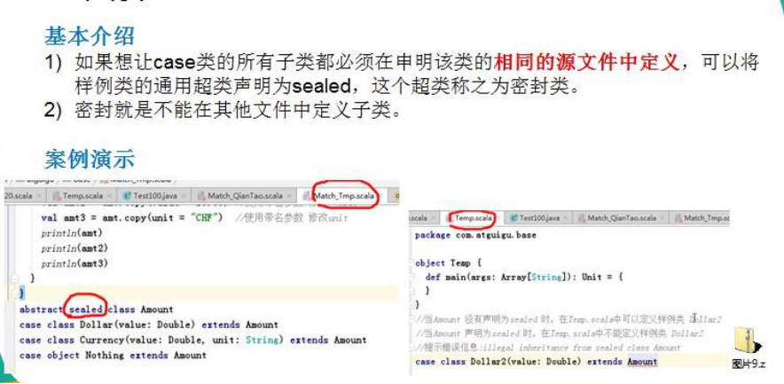

# 第 12 章函数式编程高级

### 偏函数(partial function)

```scala
object PartialFunDemo02 {
    def main(args: Array[String]): Unit = {
        //使用偏函数解决
        val list = List(1, 2, 3, 4, "hello")
        //定义一个偏函数
        //1. PartialFunction[Any,Int]  表示偏函数接收的参数类型是 Any,返回类型是 Int
        //2. isDefinedAt(x: Any) 如果返回 true ,就会去调用 apply 构建对象实例,如果是 false,过滤
        //3. apply  构造器 ,对传入的值 + 1,并返回（新的集合） 
        val partialFun = new PartialFunction[Any,Int] {

            override def isDefinedAt(x: Any) = { 
                println("x=" + x)
                x.isInstanceOf[Int]
            }


            override def apply(v1: Any) = { 
                println("v1=" + v1) 
                v1.asInstanceOf[Int] + 1
            }
}


        //使用偏函数
        //说明：如果是使用偏函数，则不能使用 map,应该使用 collect
        //说明一下偏函数的执行流程
        //1. 遍历 list 所有元素
        //2. 然后调用 val element = if(partialFun-isDefinedAt(list 单个元素)) 
        //{partialFun-apply(list 单个元素) }
        //3. 每得到一个 element,放入到新的集合，最后返回
        val list2 = list.collect(partialFun)
		println("list2" + list2)
}
}
```


#### 偏函数的小结

1. 使用构建特质的实现类(使用的方式是 PartialFunction 的匿名子类)

2. PartialFunction 是个特质(看源码)

3. 构建偏函数时，参数形式 \[Any, Int\]是泛型，第一个表示参数类型，第二个表示返回参数

4. 当使用偏函数时，会遍历集合的所有元素，编译器执行流程时先执行 isDefinedAt()如果为 true ,就会执行 apply, 构建一个新的 对象返回

5. 执行 isDefinedAt() 为 false 就过滤掉这个元素，即不构建新的 对象.

6. map 函数不支持偏函数，因为 map 底层的机制就是所有循环遍历，无法过滤处理原来集合的元素

7. collect 函数支持偏函数

#### 偏函数的简写形式

```scala
def partialFun2: PartialFunction[Any,Int] = {
    //简写成 case 语句
    case i:Int => i + 1
    case j:Double => (j * 2).toInt
}
//第二种简写形式 
val list3 = list.collect{
    case i:Int => i + 1
    case j:Double => (j * 2).toInt 
    case k:Float => (k * 3).toInt
}
```

### 作为参数的函数

函数作为一个变量传入到了另一个函数中，那么该作为参数的函数的类型是：function1，即：(参数类型) =\> 返回类型

```scala
object FunParameter {
def main(args: Array[String]): Unit = { 
    def plus(x: Int) = 3 + x
	//说明
    val result1 = Array(1, 2, 3, 4).map(plus(_)) 
    println(result1.mkString(",")) //(4,5,6,7)

    //说明
    //1. 在 scala 中，函数也是有类型，比如 plus 就是 <function1>
    println("puls 的函数类型 function1" + (plus _))

}
}
```

### 匿名函数

没有名字的函数就是匿名函数，可以通过函数表达式来设置匿名函数

```scala
object AnonymouseFunction {
def main(args: Array[String]): Unit = {
    //对匿名函数的说明
    //1. 不需要写 def 函数名
    //2. 不需要写返回类型，使用类型推导
    //3. =	变成	=>
    //4. 如果有多行，则使用{} 包括
    val triple = (x: Double) => { 
        println("x=" + x)
        3 * x
    }
	println("triple" + triple(3)) // 9.0


}
}
```

### 高阶函数

能够接受函数作为参数的函数，叫做高阶函数 (higher-order function)。可使应用程序更加健壮。

高阶函数可以返回函数类型

```scala
object HigherOrderFunction {
def main(args: Array[String]): Unit = {
    def test(f: Double => Double, f2: Double =>Int ,n1: Double) = { 
        f(f2(n1)) // f(0)
    }
    //sum 是接收一个 Double,返回一个 Double 
    def sum(d: Double): Double = {
    	d + d
    }

    def mod(d:Double): Int = { 
        d.toInt % 2
    }

    val res = test(sum, mod, 5.0) // println("res=" + res) // 2.0

}
}


object HigherOrderFunction2 {
    def main(args: Array[String]): Unit = {
    //说明
    //1. minusxy 是高阶函数,因为它返回匿名函数
    //2. 返回的匿名函数 (y: Int) => x - y
    //3. 返回的匿名函数可以使用变量接收

        def minusxy(x: Int) = {
            (y: Int) => x - y //匿名函数
        }

        //分步执行
        //f1 就是 (y: Int) => 3 - y 
        val f1 = minusxy(3) 
        println("f1 的类型=" + f1) 
        println(f1(1)) //	2
        println(f1(9)) //	-6
        //也可以一步到位的调用
        println(minusxy(4)(9)) // -5
}
}
```

### 参数(类型)推断

参数推断省去类型信息（在某些情况下\[**需要有应用场景**\]，参数类型是可以推断出来的，如

#### 参数类型推断写法说明

1. 参数类型是可以推断时，可以省略参数类型

2. 当传入的函数，只有单个参数时，可以省去括号

3. 如果变量只在=\>右边只出现一次，可以用\_来代替

```scala
val list = List(1, 2, 3, 4) 
println(list.map((x:Int)=>x + 1)) //(2,3,4,5) 
println(list.map((x)=>x + 1))
println(list.map(x=>x + 1))
println(list.map(_ + 1)) 

println(list.reduce(f1)) // 10 
println(list.reduce((n1:Int ,n2:Int) => n1 + n2)) //10 
println(list.reduce((n1 ,n2) => n1 + n2)) //10 
println(list.reduce( _ + _)) //10

def f1(n1:Int ,n2:Int): Int = { n1 + n2
}
```

### 闭包(closure)

基本介绍：闭包就是**一个函数**和**与其相关的引用环境**组合的一个**整体**(实体)。

```scala
def minusxy(x: Int) = (y: Int) => x - y
//f 函数就是闭包.
val f = minusxy(20)
println("f(1)=" + f(1)) // 19
println("f(2)=" + f(2)) // 18
```

对上面代码的小结和说明

1. (y: Int) =\> x -- y返回的是一个匿名函数 ，因为该函数引用到到函数外的 x,那么 该函数和 x 整体形成一个闭包如：这里 val f = minusxy(20) 的 f 函数就是闭包

2. 你可以这样理解，返回函数是一个对象，而 x 就是该对象的一个字段，他们共同形成一个闭包

3. 当多次调用 f 时（可以理解多次调用闭包），发现使用的是同一个 x, 所以 x 不变。

4. 在使用闭包时，主要搞清楚返回函数引用了函数外的哪些变量，因为他们会组合成一个整体(实体),形成一个闭包

### 函数柯里化(curry)

函数编程中，接受多个参数的函数都可以转化为接受单个参数的函数，这个转化过程就叫柯里化

柯里化就是证明了函数只需要一个参数而已。其实我们刚才的学习过程中，已经涉及到了柯里化操作。

```
//说明
def mul(x: Int, y: Int) = x * y 
println(mul(10, 10))

def mulCurry(x: Int) = (y: Int) => x * y 
println(mulCurry(10)(9))

def mulCurry2(x: Int)(y:Int) = x * y 
println(mulCurry2(10)(8))
```

### 控制抽象

控制抽象是这样的函数，满足如下条件

1. 参数是函数

2. 函数参数没有输入值也没有返回值

```scala
object AbstractControl {
    def main(args: Array[String]): Unit = {
        //myRunInThread 就是一个抽象控制
        //是没有输入， 也没有输出的函数 f1: () => Unit 
        def myRunInThread(f1: () => Unit) = {
            new Thread {
           		override def run(): Unit = { f1() //只写了 f1
            	}
            }.start()
        }


        myRunInThread { 
            () =>
                println("干活咯！5 秒完成...")
                Thread.sleep(5000) println("干完咯！")

        }


        //简写形式
        def myRunInThread2(f1:	=> Unit) = { 
            new Thread {
                override def run(): Unit = { f1 //只写了 f1
                }
                }.start()
        }

        //对于没有输入，也没有返回值函数，可以简写成如下形式myRunInThread2 {
        println("干活咯！5 秒完成...~~~") Thread.sleep(5000)
        println("干完咯！~~~")
        }


    }
}
```

# 第 13 章设计模式

### 设计模式类型

设计模式分为三种类型，共 23 种

1. 创建型模式：单例模式、抽象工厂模式、建造者模式、工厂模式、原型模式。

2. 结构型模式：适配器模式、桥接模式、装饰模式、组合模式、外观模式、享元模式、代理模式

4. 行为型模式：模版方法模式、命令模式、迭代器模式、观察者模式、中介者模式、备忘录模式、解释器模式（Interpreter 模式）、状态模式、策略模式、职责链模式(责任链模式)、访问者模式。

### 简单工厂

1.  简单工厂模式是属于创建型模式，但不属于 23 种 GOF 设计模式之一。简单工厂模式是由一个工厂对象决定创建出哪一种产品类的实例。简单工厂模式是工厂模式家族中最简单实用的模式

2.  简单工厂模式：定义了一个创建对象的类，由这个类来封装实例化对象的行为(代码)

3.  在软件开发中，当我们会用到大量的创建某种、某类或者某批对象时，就会使用到工厂模式.

### 工厂方法模式

工厂方法模式：定义了一个创建对象的抽象方法，由子类决定要实例化的类。**工厂方法模式将对象的实例化推迟到子类**。

### 抽象工厂模式

1.  抽象工厂模式：定义了一个 trait 用于创建相关或有依赖关系的对象簇，而无需指明具体的类

2.  抽象工厂模式可以将简单工厂模式和工厂方法模式进行整合。

3.  从设计层面看，抽象工厂模式就是对简单工厂模式的改进(或者称为进一步的抽象)。

4.  将工厂抽象成两层，**AbsFactory(抽象工厂)** 和 **具体实现的工厂子类**。程序员可以根据创建对象类型使用对应的工厂子类。这样将单个的简单工厂类变成了工厂簇，更利于代码的维护和扩展。

### 工厂模式的小结

1. 工厂模式的意义

   将**实例化对象的代码提取出来，放到一个类中统一管理和维护**，达到和主项目的**依赖关系的解耦**。从而提高项目的扩展和维护性

2. 设计模式的依赖抽象原则

   创建对象实例时，不要直接 new 类, 而是把这个 new 类的动作放在一个工厂的方法中，并返回。也有的书上说，变量不要直接持有具体类的引用。

   不要让类继承具体类，而是继承抽象类或者是 trait（接口）

   不要覆盖基类中已经实现的方法。

### 单例模式

单例模式是指：保证在整个的软件系统中，某个类只能存在一个对象实例。

#### 单例模式的应用场景

比如Hibernate 的SessionFactory，它充当数据存储源的代理，并负责创建Session 对象。SessionFactory并不是轻量级的，一般情况下，一个项目通常只需要一个 SessionFactory 就够，这是就会使用到单例模式。

#### 单例模式-懒汉式

```scala
object TestSingleTon {
    def main(args: Array[String]): Unit = { 
        val instance1 = SingleTon.getInstance 
        val instance2 = SingleTon.getInstance 
        if (instance1 == instance2) {
            println("相等")
        }
    }
}


//将 SingleTon 的构造方法私有化
class SingleTon private() {}

//懒汉式
//看底层
/*
    public SingleTon getInstance() { if (s() == null) {
    s_$eq(new SingleTon());
    }
    return s();
    */
object SingleTon { //SingleTon$ private var s: SingleTon = null

    def getInstance = { 
        if (s == null) {
        s = new SingleTon}
        s
    }
}
```


#### 单例模式-饿汉式

```scala
object TestSingleTon2 {
    def main(args: Array[String]): Unit = { 
        val instance1 = SingleTon2.getInstance 
        val instance2 = SingleTon2.getInstance 
        if (instance1 == instance2) {
            println("相等~~~")
    }
}


//将 SingleTon 的构造方法私有化
class SingleTon2 private() {}


//饿汉式
//看底层
/*
public SingleTon2 getInstance() { return s();
}
*/
object SingleTon2 { //SingleTon$
	private val s: SingleTon2 = new SingleTon2
    def getInstance = { s
    }
}
```


### 装饰者模式(Decorator)

#### 装饰者模式定义

装饰者模式：**动态的将新功能附加到对象上**。在对象功能扩展方面，它比**继承更有弹性(递归)**， 装饰者模式也体现了开闭原则(ocp)

### 观察者模式(Observer)


Subject：登记注册、移除和通知

1)  registerObserver 注册

2)  removeObserver 移除

3)  notifyObservers() 通知所有的注册的用户，根据不同需求，可以是更新数据，让用户来取， 也可能是实施推送，看具体需求定

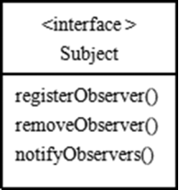

Observer：接收输入

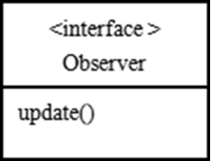

观察者模式：**对象之间多对一依赖**的一种设计方案，被依赖的对象为 Subject，依赖的对象为Observer，Subject 通知 Observer 变化,比如这里的奶站是 Subject，是 1 的一方。用户时 Observer， 是多的一方。

### 代理模式(Proxy)

1.  代理模式：**为一个对象提供一个替身**，以控制对这个对象的访问

2.  被代理的对象可以是**远程对象**、**创建开销大的对象**或需要**安全控制的**对象(动态代理)

3.  代理模式有不同的形式(比如 远程代理，静态代理，动态代理)，都是为了控制与管理对象访问

#### 动态代理

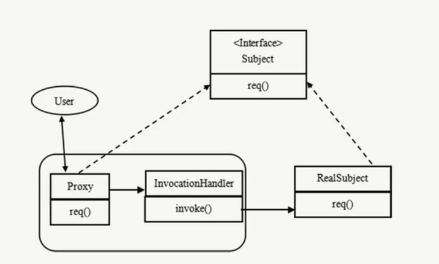

动态代理：运行时动态的创建代理类(对象)，并将方法调用转发到指定类(对象) 

1. Proxy 和 InvocationHandler 组合充当代理的角色.

2. RealSubject 是一个实际对象，它实现接口 Subject

3. 在使用时，我们不希望直接访问 RealSubject 的对象，比如：我们对这个对象的访问是有控制的

4. 我们使用动态代理，在程序中通过动态代理创建 RealSubject，并完成调用.

5. 动态代理可以根据需要，创建多种组合

6. Proxy 也会实现 Subject 接口的方法，因此，使用 Proxy+Invocation 可以完成对 RealSubject 的动态调用。

7. 但是通过 Proxy 调用 RealSubject 方法是否成功，是由 InvocationHandler 来控制的。(这里其实就是保护代理)

8. 理解：**创建一个代理对象**替**代被调用的真实对象**，使用**反射实现控**制

#### 几种常见的代理模式介绍--- 几种变体

1. 防火墙代理

   内网通过代理穿透防火墙，实现对公网的访问。

2. 缓存代理

   比如：当请求图片文件等资源时，先到缓存代理取，如果取到资源则 ok,如果取不到资源，再到公网或者数据库取，然后缓存。

3. 静态代理

   静态代理通常用于对原有业务逻辑的扩充。

   比如持有第二方包的某个类，并调用了其中的某些方法。比如记录日志、打印工作等。可以创建一个代理类实现和第二方方法相同的方法，通过让代理类持有真实对象，调用代理类方法，来达到增加业务逻辑的目的。

4. Cglib 代理

   使用 cglib\[Code Generation Library\]实现动态代理，并不要求委托类必须实现接口，底层采用 **asm** 字节码生成框架生成代理类的字节码。

5. 同步代理

   主要使用在多线程编程中，完成多线程间同步工作

# 第 14 章泛型、上下界、视图界定 、上下文界定

### 泛型


```scala
object GenericDemo02 {
def main(args: Array[String]): Unit = {

        //使用
        val class01 = new EnglishClass[SeasonEnum.SeasonEnum,String,String]
    	(SeasonEnum.spring,"0705 班","高级班")
        println("class01 " + class01.classSesaon + " " + class01.className +
                class01.classType)


		val class02 = new EnglishClass[SeasonEnum.SeasonEnum,String,Int]
    	(SeasonEnum.spring,"0707 班",1)


		println("class02 " + class02.classSesaon + " " + class02.className + 
                class02.classType)
}
}


class EnglishClass[A, B, C](val classSesaon: A, val className: B, val classType: C)


//季节是枚举类型
class SeasonEnum extends Enumeration { 
    type SeasonEnum = Value
    val spring,autumn,summer,winter = Value
}
```

### 类型约束-上界(Upper Bounds)/下界(lower bounds)

#### scala 中上界

在 scala 里表示某个类型是 A 类型的子类型，也称上界或上限，使用 \<: 关键字，语法如下：

[T \<: A\]	或用通配符	[\_ \<: A\]

#### scala 中下界

在 scala 的下界或下限，使用 \>: 关键字，语法如下：

[T \>: A\]或用通配符\[\_ \>: A\]

### 视图界定

```scala
object ViewBoundsDemo03 {
    def main(args: Array[String]): Unit = { 
        val p1 = new Person3("汤姆", 13) 
        val p2 = new Person3("杰克", 10)
        //引入隐式函数
        import MyImplicit._
    	val compareComm3 = new CompareComm3(p1,p2) 
        println(compareComm3.getter)


}
}


class Person3(val name: String, val age: Int)	{
    //这里是重写 toString,为了显示方便
    override def toString: String = this.name + "\t" + this.age

}
//说明
//1.	T <% Ordered[T] 表示 T 是 Ordered 子类型 java.lang.Comparable
//2.	这里调用的 compareTo 方法是 T 这个类型的方法
class CompareComm3[T <% Ordered[T]](obj1: T, obj2: T) { 
    def getter = if (obj1 > obj2) obj1 else obj2
    def geatter2 = if (obj1.compareTo(obj2) > 0) obj1 else obj2
}
```


### 类型约束-上下文界定(Context bounds)

```scala
object ContextBoundsDemo {
//这里我定义一个隐式值	Ordering[Person]类型
    implicit val personComparetor = new Ordering[Person4] {
		override def compare(p1: Person4, p2: Person4): Int = p1.age - p2.age
	}


    def main(args: Array[String]): Unit = {
        //
        val p1 = new Person4("mary", 30) 
        val p2 = new Person4("smith", 35)
        val compareComm4 = new CompareComm4(p1, p2) 
        println(compareComm4.geatter) // "smith", 35

        val compareComm5 = new CompareComm5(p1, p2) 
        println(compareComm5.geatter) // "smith", 35

        println("personComparetor hashcode=" + personComparetor.hashCode()) 
        val compareComm6 = new CompareComm6(p1, p2) 
        println(compareComm6.geatter) // "smith", 35


}
}
//一个普通的 Person 类
class Person4(val name: String, val age: Int) {
    //重写 toStirng
    override def toString = this.name + "\t" + this.age
}


//方式 1
//说明：
//1. [T: Ordering] 泛型
//2. obj1: T, obj2: T 接受 T 类型的对象
//3. implicit comparetor: Ordering[T] 是一个隐式参数
class CompareComm4[T: Ordering](obj1: T, obj2: T)(implicit comparetor: Ordering[T]) { 	def geatter = if (comparetor.compare(obj1, obj2) > 0) obj1 else obj2
}
//方式 2
//方式 2,将隐式参数放到方法内
class CompareComm5[T: Ordering](o1: T, o2: T) { 
    def geatter = {
		def f1(implicit cmptor: Ordering[T]) = cmptor.compare(o1, o2) //返回一个数字
		//如果 f1 返回的值>0,就返回 o1,否则返回 o2 if (f1 > 0) o1 else o2
	}
    def lowwer = {
        def f1(implicit cmptor: Ordering[T]) = cmptor.compare(o1, o2) //返回一个数字
        //如果 f1 返回的值>0,就返回 o1,否则返回 o2 if (f1 > 0) o2 else o1
    }
}


//方式 3
//方式 3,使用 implicitly 语法糖，最简单(推荐使用) 
class CompareComm6[T: Ordering](o1: T, o2: T) {
    def geatter = {
    //这句话就是会发生隐式转换，获取到隐式值 personComparetor
    //底层仍然使用编译器来完成绑定(赋值的)工作
        val comparetor = implicitly[Ordering[T]]
    	println("comparetor hashcode=" + comparetor.hashCode()) 
        if (comparetor.compare(o1, o2) > 0) o1 else o2
}
}
```


### 协变、逆变和不变

1. Scala 的协变(+)，逆变(-)，协变 covariant、逆变 contravariant、不可变 invariant

2. 对于一个带类型参数的类型，比如 List\[T\]，如果对 A 及其子类型 B，满足 List\[B\]也符合 List\[A\] 的子类型，那么就称为 covariance(协变) ，如果 List\[A\]是 List\[B\]的子类型，即与原来的父子关系正相反，则称为 contravariance(逆变)。如果一个类型支持协变或逆变，则称这个类型为 variance(翻译为可变的或变型)，否则称为 invariance(不可变的)

3. 在 Java 里，泛型类型都是 invariant，比如 List\<String\> 并不是 List\<Object\> 的子类型。而 scala 支持，可以在定义类型时声明(用加号表示为协变，减号表示逆变)，如: trait List\[+T\] // 在类型定义时声明为协变这样会把 List\[String\]作为 List\[Any\]的子类型。

```scala
object Demo {
def main(args: Array[String]): Unit = {
    val t1: Temp3[Sub] = new Temp3[Sub]("hello");  //ok
    val t2: Temp3[Sub] = new Temp3[Super]("hello");//error
    val t3: Temp3[Super] = new Temp3[Sub]("hello");//error
    val t4: Temp3[Sub] = new Temp3[Sub]("hello"); //ok 
    val t5: Temp4[Super] = new Temp4[Sub]("hello"); //ok
    val t6: Temp4[Sub] = new Temp4[Super]("hello"); //ok
    val t7: Temp5[Sub] = new Temp5[Sub]("hello"); //ok 
    val t8: Temp5[Sub] = new Temp5[Super]("hello"); //ok
    val t9: Temp5[Super] = new Temp5[Sub]("hello"); //ok

}
}


//协变
class Temp4[+A](title: String) { //Temp3[+A] //Temp[-A] 
    override def toString: String = {
        title

}
}

//逆变
class Temp5[-A](title: String) { //Temp3[+A] //Temp[-A] 
    override def toString: String = {
        title

}
}


//不变
class Temp3[A](title: String) { //Temp3[+A] //Temp[-A] 
    override def toString: String = {
        title
}
}


//支持协变
class Super //父类


//Sub 是 Super 的子类
class Sub extends Super
```

